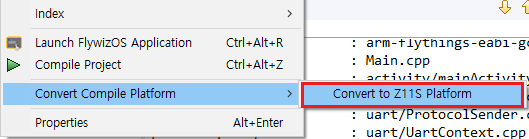

# Convert compile platform

In order to facilitate the use of the same project source code on different hardware platforms, the function of **Convert Compie Platform** is provided.

Steps :
  1. Select the project name, right-click, and select **Convert Compile Platform** in the pop-up context menu to quickly switch platforms.

  

# For the conversion function, the following points need to be noted:
  1. The conversion function is essentially to reconfigure the compilation environment such as the compilation tool chain, and there will be no changes to the source code.
  2. The hardware of different platforms is different, so the hardware-related settings such as serial port and GPIO need to be modified manually.
  3. Due to differences in toolchain versions, compilation failures may occur after conversion. This also requires manual modification of Makefile or source code to solve this problem.