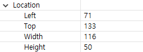

# Common properties
Before we start to introduce each control, let's have a basic understanding of some common properties and setting interfaces of the control ;

## <span id = "widgetID">Control ID value</span>
The ID value is the unique identifier of the control. The control ID value in each ftu file is not allowed to have the same name. The control ID value in different ftu files is allowed to have the same name; after setting the ID value, it will be compiled in **activity* *The corresponding macro definition is generated in the corresponding header file in the directory:


Get the ID value of the control:
```c++
/**
 * The interface is defined in the control base class "ZKBase"
 * Header file location: include/control/ZKBase.h
 *
 * Note: The following interfaces, unless otherwise specified, mean that all controls defined in the ZKBase class directly or   
 * indirectly inherit the ZKBase class, so all controls can call the public interface in the ZKBase class
 */
int getID() const;

/* Operation example: Click the button control to print the ID value of the control */
static bool onButtonClick_Button1(ZKButton *pButton) {
    int id = pButton->getID();
    LOGD("onButtonClick_Button1 id %d\n", id);
    return false;
}
```

## Control location
We open any ftu file, select any control, in the property box, we can see the attribute **coordinates**, which determines the display position of the control :



The coordinates of the upper left corner are relative to the upper left corner of the parent control ;<br/>
Set and get the position of the control through code :

```c++
/* Interface description */
// Set location
void setPosition(const LayoutPosition &position);
// Get location
const LayoutPosition& getPosition();


/* Operation esample */
// Click the button control to set the button position
static bool onButtonClick_Button1(ZKButton *pButton) {
    // left：0，top：0，width：100，height：200
    LayoutPosition pos(0, 0, 100, 200);
    pButton->setPosition(pos);
    return false;
}

// Click the button control to get the button position
static bool onButtonClick_Button2(ZKButton *pButton) {
    // The mLeft, mTop, mWidth, and mHeight variables of pos correspond to the coordinate values respectively.
    LayoutPosition pos = pButton->getPosition();
    return false;
}
```

## Background color


This is simple, modify the color to see the effect ;<br/>
Code to set the background color :

```c++
/* When color is -1, the background is set to transparent; other color values are 0xRGB, and the color value does not support alpha */
void setBackgroundColor(int color);


/* Operation example : Click the button control and set the background color to red */
static bool onButtonClick_Button1(ZKButton *pButton) {
    pButton->setBackgroundColor(0xFF0000);
    return false;
}
```

## Background picture


After selecting the picture, you can see the effect


Here we focus on explaining how to set the background image through code :
```c++
/**
 * The pPicPath parameter can have the following two ways :
 * 1. The absolute path, such as : "/mnt/extsd/pic/bg.png"
 * 2. Relative resource directory path, you only need to put the picture in the resources directory of the project, after 
 * compiling, you can use it. If there is a bg.png picture in the resource directory, just set "bg.png".
 */
void setBackgroundPic(const char *pPicPath);


/* Operation example */
mButton1Ptr->setBackgroundPic("/mnt/extsd/pic/bg.png"); // Set the absolute path
mButton1Ptr->setBackgroundPic("bg.png");    // Set the bg.png picture in the resource directory
```

## 显示与隐藏


Through this property, we can set the default display or hidden state of the control.

Double-click the control in the outline view to quickly modify the state :


In addition, we can also dynamically set the control display and hide through code :
```c++
void setVisible(BOOL isVisible);
BOOL isVisible() const;

/* Operation example */
mButton1Ptr->setVisible(TRUE);  // Show the button control
mButton1Ptr->setVisible(FALSE); // Hide the button control


/**
 * Window controls can also use the following interface, the same function
 * Header file location : include/window/ZKWindow.h
 */
void showWnd();  // Show window
void hideWnd();  // Hide window
bool isWndShow() const;  // Whether the window is displayed

/* Operation example */
mWindow1Ptr->showWnd();
mWindow1Ptr->hideWnd();
```

## Control state
For **text**, **button**, and **list item**, they have 5 states, here we need to explain : **normal/pressed/selected/pressed and selected /invalid state**. After setting, it will affect the background color, text color and display picture of the corresponding state of the control;


The pressed state does not need to be set by code, the touch control which is the pressed state ;<br/>Operation interface of selected state and invalid state :
```c++
// Set selected state
void setSelected(BOOL isSelected);
BOOL isSelected() const;

/* Operation sample */
mButton1Ptr->setSelected(TRUE);
mButton1Ptr->setSelected(FALSE);


/**
 * Invalid state function description: when the control is set to the invalid state, the touch control has no effect, that is, 
 * it does not respond to the press and lift event
 */
// Set invalid state
void setInvalid(BOOL isInvalid);
BOOL isInvalid() const;

/* Operation example */
mButton1Ptr->setInvalid(TRUE);
mButton1Ptr->setInvalid(FALSE);
```

## Example description

We use the following small examples to understand the simple usage of related interface functions of common attributes.

### 1.Create control

First, we create a new FlywizOS project, double-click to open the main.ftu file under the project UI folder, and drag the button control and text control in the control bar.


### 2.Compile the project
(If you are not sure about the specific operation, please see the ["How to compile the FlywizOS project"](how_to_compile_flywizOS.md#how_to_compile_flywizOS) chapter)


### 3.Call control property function
After the compilation is complete, open the jni/logic/mainLogic.cc file in the project and you can see that the `onButtonClick_Button1` function is generated at the bottom of the file.
**We will call the getID() function in this function to get the ID value of the Button1 control , and call the setText() function to display it in the TextView1 control. **
([If you are not clear about the corresponding rules between the pointer variable name and the control ID in the UI file, click here](named_rule.md))


### 4.Download and debugging
In the project manager, select the project name, right-click, and select **Download and Debug** in the pop-up menu to temporarily download the program to the screen and run it. After running, click the button to see the [ID value of Button1 control](#widgetID) is 20001.

### Note :

<font color="#E6161E" size="4">To learn more about the setting interface functions of the common properties of the control, you can open the /jni/include/control/ZKBase.h file, and the main property setting interface functions have been commented.</font>
