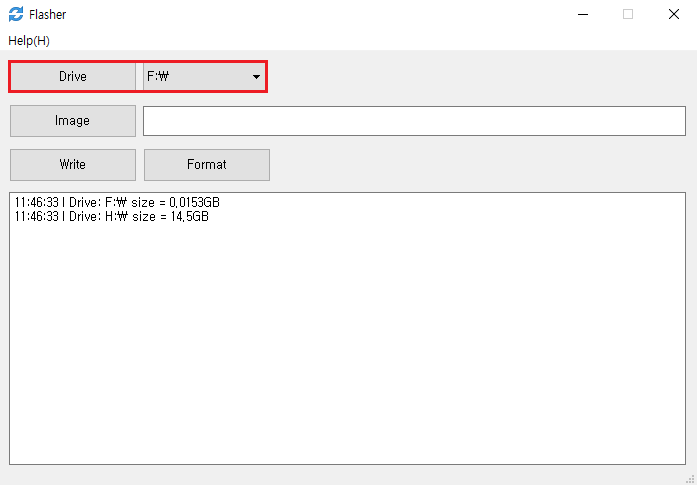
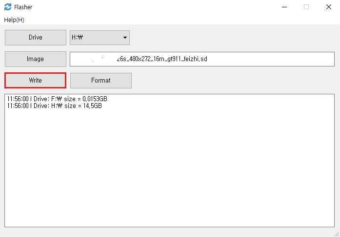
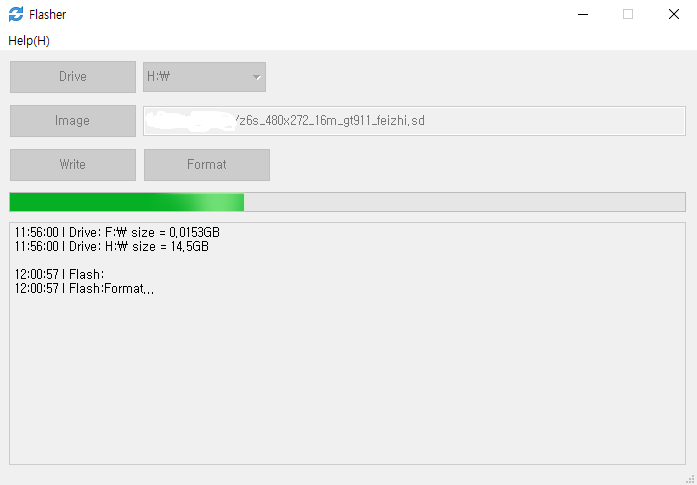
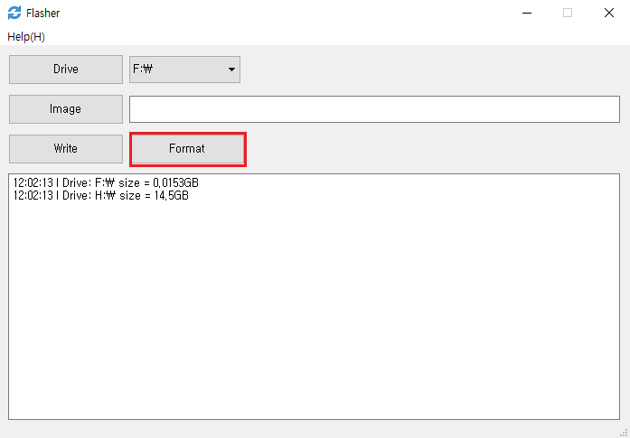

​      
## Make swipe card
>[!Warning]
> **Note: The maximum capacity of the TF card supports 16G. If it is too large, the machine cannot recognize the TF card and cannot be upgraded. For the latest software update package, please go to the QQ group: [371608200](//shang.qq.com/wpa/qunwpa?idkey=da6e12d1773a7e55295a0accd2a46ad51aece61657fe55a2f8277f4cd91dc56a) group sharing download. Pay attention to find the corresponding version of the software on the back of the machine [label]( board_tag_explain.md), otherwise the upgrade may cause abnormalities! **

1. Download [Computer Flash Tool](http://download.zkswe.com/tool/Flasher.zip)
2. Select the TF card drive on the computer 
    

3. Specify the upgraded image file   
    

4. Click to burn   
    
    
    

5. After the programming is successful, pull out the TF card, insert the machine, and then power on again to upgrade

## Recovery card
1. Select the TF card drive on the computer
    

2. Click to recovery card    
    
    
    

3. After formatting, the card will resume normal use

