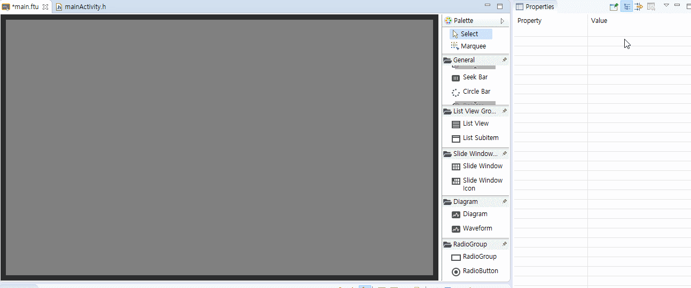

# Seek Bar control
## How to use Seek Bar control
In many cases, we will use the seek bar, for example: 
**Volume adjustment**  
  

Using a few simple pictures, we can quickly implement this effect.  
1. First, we prepare four resource pictures  
  * Background picture    
      
  * Valid picture  
    
  * Thumb - normal picture   
     
  * Thumb - pressed picture  
    

2. In the editor, create a Seek Bar control  

 
  If you don’t know how to create controls, [Refer to Creating Button Controls](#add_button)

3. The default Seek Bar style is transparent, and we must add enough image resources for it to work properly.  
    In the property table, we set the **Valid Picture, Thumb-Normal Picture, Thumb-Pressed Picture and Background Picture**.

      
4. After the previous step is completed, the creation of a Seek Bar is basically completed. If you want to preview the sliding effect of the Seek Bar in the tool, you can modify the **max value** property and **default progress** property. In the real-time preview, you can see the position change of the Seek Bar cursor.

## How to control the progress of the Seek Bar in the code? How to get the current progress of the Seek Bar?
If we use a Seek Bar to implement a volume bar, we must know the progress value of the current volume bar, and once the volume bar changes, we must also adjust the volume simultaneously.  
So, we have the following 3 functions to solve these problems. 

1. `static void onProgressChanged_XXXX(ZKSeekBar *pSeekBar, int progress)`
    Progress value change monitoring function  
    If you create a slider control in the UI file, this function will be automatically added to the corresponding `XXXXLogic.cc` file after **compiling FlywizOS**.  
    When sliding the seek bar on the touch screen, or when the current value of the seek bar changes, the system will automatically call this function.
```
  static void onProgressChanged_XXXX(ZKSeekBar *pSeekBar, int progress) {
      //LOGD("XXXXThe progress value of the seek bar changes to %d !\n", progress);
}
```
2. `void setProgress(int progress)`  
    Used to set the current progress of the slider. E.g:
  ```  
  //Set the seek bar progress to 28
  mSeekbarPtr->setProgress(28)
  ```
3. `int getProgress()`  
    Used to get the progress value of the current seek bar. E.g: 
  ```
  int progress = mSeekbarPtr->getProgress();
  LOGD("The current progress value of the seek bar %s", progress);
  ```


## Sample 
For more use of slider controls, please refer to SeekBarDemo project in [Sample Code](demo_download.md#demo_download)

Sample preview :


