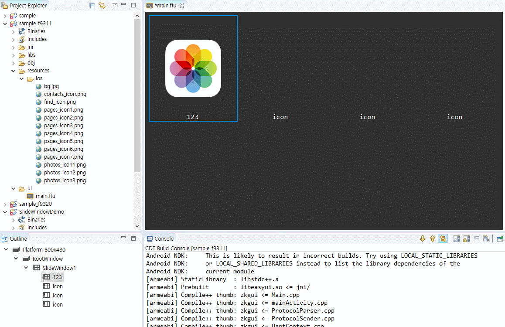

# Slide window control
The slide window control is similar to the interface effect of sliding left and right on the main interface of the mobile phone. Consists of a sliding main window and multiple icons.
## How to use
1. First create a **Slide Window** control in the UI file, and then add multiple **Slide Window Icon** controls to the main window control. 

   

2.  When adding a **Slide window icon** control, it will automatically arrange the icons in order. If you add a full page, continue adding it will automatically turn the page. All the added icon controls can be found in **Outline**.  

      
    
    If you want to adjust the position of the **sliding window icons**, you can select the node in the outline view, and then directly adjust it by dragging. Note the operation of the outline view in the lower left corner of the animation below.   
    
    

3. In the **outline view**, select the **slide window icon** control, you can add pictures and modify the text separately; select the entire **slide window** to adjust the number of rows and columns, and you can also adjust it uniformly font size, icon size.

      


## Code operating  

1. If you add a slide window control, then after compiling, an associated function will be automatically generated. For detailed function description, please refer to [Slide Window Related Function](relation_function.md#slidewindow)

2. In general, we only need to scroll up and down by touching and sliding. However, we also provide the corresponding page turning function.
  * Switch to the next page
    ```c++
    // Switch to the next page with animation
    mSlideWindow1Ptr->turnToNextPage(true);
    // Switch to the next page without animation
    mSlideWindow1Ptr->turnToNextPage(false);
    ```
  * Switch to the previous page
    ```c++
    // Switch to the previous page with animation
    mSlideWindow1Ptr->turnToPrevPage(true);
    // Switch to the previous page without animation
    mSlideWindow1Ptr->turnToPrevPage(false);
    ```
3. We can also monitor which page the slide window has turned to through the code :  
    ```c++
    namespace { // Add an anonymous scope to prevent multiple source files from defining the same class name and conflict at
        		// runtime
    // Implement your own listening interface
    class MySlidePageChangeListener : public ZKSlideWindow::ISlidePageChangeListener {
    public:
        virtual void onSlidePageChange(ZKSlideWindow *pSlideWindow, int page) {
            LOGD("Now switch to page %d", page);
        }
    };
    }
    // Define the listening object
static MySlidePageChangeListener sMySlidePageChangeListener;
    
    static void onUI_init() {
        mSlidewindow1Ptr->setSlidePageChangeListener(&sMySlidePageChangeListener);
    }
    ```
    
4. Get the current page
    ```c++
    int i = mSlideWindow1Ptr->getCurrentPage();
    LOGD("Current page %d", i);
    ```


# Sample code

   

For specific use of sliding window controls, refer to the SlideWindowDemo project in [Sample Code](demo_download.md#demo_download).

