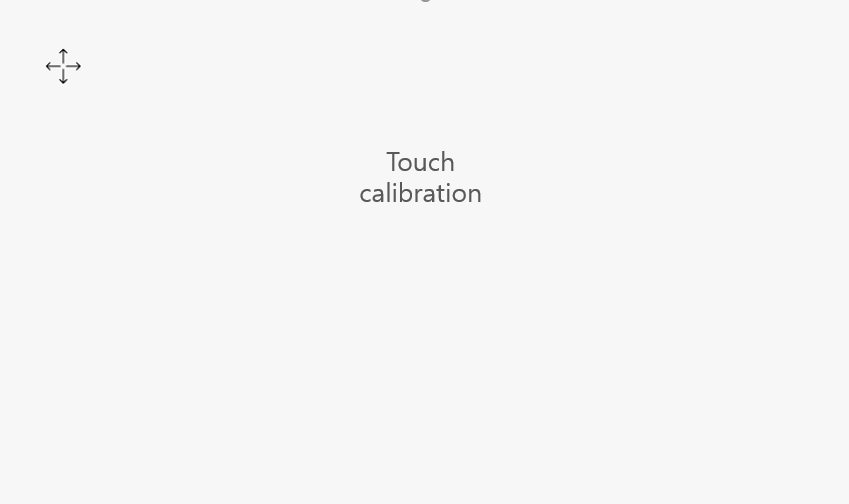

# Touch calibration
After the resistive touch screen machine is flashed, the system will perform a touch calibration the first time it is turned on. The calibration interface is as follows:



Click the "cross icon" to calibrate; we want to calibrate again later, we have the following 3 methods :
1. Modify the project properties through the tool, check the **Touch calibration after booting** option, so that each time you start up, you will enter the touch calibration interface:

     <br/>
2. Create a file **zktouchcalib** in the root directory of the TF card (note: the file does not have a extension), after inserting the card, it will enter the touch calibration interface

     <br/>
3. Start the touch calibration activity by code
```c++
EASYUICONTEXT->openActivity("TouchCalibrationActivity");
```
