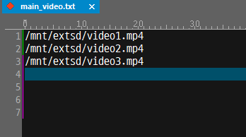

# Video view
FlywizOS also provides controls for video playback. 

> [!Note]
> The video playback function is not supported by all versions of the machine! If you need to use this function normally, please purchase a machine version with multimedia functions. 

## Use controls to loop video playback  
1. First, create a **Video view** control. The default background color is black.

2. View the property table of **Video view** 

     

   Among them, one property is **Loop**   
   If you choose **Yes**, then every time you enter this activity, it will automatically read the configuration file in the TF card directory and play the video specified in the configuration file in a loop. Exit the activity and automatically stop playing. This property is very suitable for scenes where only the video needs to be played without user intervention, such as carousel advertising machines, automatic playback of a short video, etc.
   If you select **No**, only a rendering area of the video will be created, and there will be no other operations. Then, you need to operate the video playback yourself.

3. Create video configuration file  
As mentioned above, if it is a **Loop**, the video configuration file will be automatically read. You need to create it yourself.  
This configuration file needs to be located in the root directory of the TF card, the file name is **XXXX_video_list.txt**
XXXX represents the corresponding UI file prefix name. For example: I added a video control to **main.ftu**, then the corresponding configuration file name is **main_video_list.txt**  
The configuration file is in units of lines, and each line is the absolute path of the video file. If the video file is also located in the root directory of the TF card, then directly fill in `/mnt/extsd/` and add the video file name.   

  

  **Note: To prevent video file reading failure due to encoding problems, please try to name the video file in English. **
4. After the program runs, you can automatically loop the videos in the configuration file.

## Play the specified video file
1. Create a **video view** control 
2. Set the property `Loop` to No.
3. Add code to control the playback logic  

Play

  ```c++
  //Play the test.mp4 file, starting from time 0
  mVideoView1Ptr->play("/mnt/extsd/test.mp4", 0);
  ```
  Pause
  ```c++
  //Pause playback
  mVideoView1Ptr->pause();
  ```
  Resume
  ```c++
  //Resume playback
  mVideoView1Ptr->resume();
  ```
  Stop
  ```c++
  mVideoView1Ptr->stop();
  ```
  Jump to the specified time to play
  ```c++
  //Jump to the 10 second position
  mVideoView1Ptr->seekTo(10 * 1000);
  ```
  Set playback volume, range 0~1.0
  ```c++
  //Set the volume to 0.5
  mVideoView1Ptr->setVolume(0.5);
  ```
  Determine if it is playing
  ```c++
  bool state = mVideoView1Ptr->isPlaying();
  if （state) {
    LOGD("Now Playing");
  }
  ```
  Get the total duration of the video, in milliseconds
  ```c++
  int n = mVideoView1Ptr->getDuration();
  ```

  Get the current playback position of the video, in milliseconds
  ```c++
  int n = mVideoView1Ptr->getCurrentPosition();
  ```

  The video is played asynchronously, and the automatically generated associated function will notify us of the status of the video playback
  ```c++
    static void onVideoViewPlayerMessageListener_VideoView1(ZKVideoView *pVideoView, int msg) {
        switch (msg) {
        case ZKVideoView::E_MSGTYPE_VIDEO_PLAY_STARTED:
          LOGD("Start playback");
            break;
        case ZKVideoView::E_MSGTYPE_VIDEO_PLAY_COMPLETED:
          LOGD("End playback");
            break;
        case ZKVideoView::E_MSGTYPE_VIDEO_PLAY_ERROR:
          LOGD("Error");
            break;
        }
    }
  ```

## Implementation of a complete video player
If you have higher requirements for video playback, you need to control play/pause, drag the video progress bar, etc.    
You can refer to [Complete Video Player Sample (to be continued)]()

## Sample code
In this example, the loop playback of the video and the adjustment of the video volume are realized.   
For specific implementation, refer to the VideDemo project in [Sample Code](demo_download.md#demo_download).

 