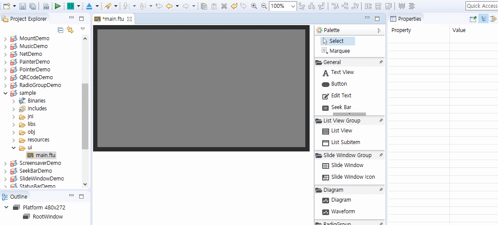
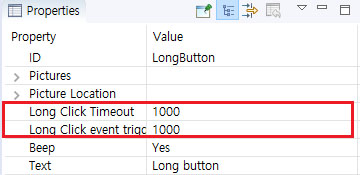

# Button
## <span id = "add_button">ボタンを追加し、プロパティの変更</span>

1. プロジェクトウィンドウでボタンを追加しようとするアクティビティのUIをダブルクリックします。
2. 右側のコントロールボックスで`Button`コントロールを選択します。
3. `Button`コントロールを左クリックした後、目的の場所をクリックするか、ドラッグアンドドロップすると、コントロールが作成されます。
4. 作成されたボタンを左クリックすると、プロパティウィンドウで、ボタンに関連するプロパティを確認し、変更することができます。

   


## ボタンの色を変更

 [「テキストと色の変更」](textview.md＃change_color)を参照してください。


## <span id = "add_button_style">ボタンにアニメーション効果を追加</span>

["ボタンの状態に応じた画像を追加"](#add_multi_state_photo_for_button)を参照してください。


## <span id = "add_multi_state_photo_for_button">ボタンの状態に応じた画像を追加</span>

 デフォルトボタンコントロールの色は単色であるが、ユーザーが希望する画像などを追加することができ、以下はその方法です。

 1. まず、UIファイルにボタンを追加します。
 2. 追加されたボタンを左クリックして、プロパティウィンドウを開きます。
イメージと関連した属性は下記の通りです。
  * Picture settings
      - この属性は、ボタンのそれぞれの状態に応じた画像を設定することができて、ボタンの状態が変わると自動的にそのイメージに変更されます。
  * Picture location
     - 基本的にはボタンに設定された画像は、ボタンの中央を基準に拡大/縮小され、ボタンと同じサイズに変更されるが、この属性は、画像をボタンの特定の場所に特定のサイズに位置させることができます。
  * Background picture
     - ボタンの背景画像を設定します。画像は自動的にボタンのサイズだけ拡大/縮小されて表示されます。

  例：   

  

  結果の画像 :  

  

 上記のスクリーンショットは、プロパティウィンドウのパラメータの値を示し、それの意味は次のとおりです。
 ボタンは、基本的に「off_normal.png」を表示し、選択されたとき、「on_normal.png」に変更されます。
 left、top、width、heightは画像の表示位置（ピクセル単位）を決定します。長方形の左上隅が開始点（0、0）であり、右/下方向に値が増加し、（131、63）が終了点です。もし画像の実際のwidthとheightが[プロパティ]ウィンドウのパラメータの値と異なる場合、画像は、その属性の値に基づいて拡大/縮小されます。

  

### ボタンコントロールとの間の階層関係
一般的に、ボタンコントロールは4段階の過程を経て表示されます。
* ボタンのテキスト

* ボタンの画像

* ボタンの背景画像

* ボタンの背景色

  

## ボタンに画像を追加
["ボタンの状態に応じた画像を追加"](#add_multi_state_photo_for_button)参考

## ボタンが押されたとき、どこで、どのようにコードを追加しますか？
 実際の開発ではボタンは非常に頻繁に使用されるコントロールの一つです。通常のボタンのクリックイベントが発生した後のUI画面の内容が更新されるなどの処理が行われます。このため、ボタンがクリックされたときの応答を処理する過程が必要であり、下はこれに対するプロセスです。

1. まず、IDが`Button1`のボタンを作成します。

   
2. プロジェクトエクスプローラで、現在のプロジェクトを選択し、右クリックして表示されるポップアップメニューの中`Compile Project`を選択します。 この機能は、UIファイルに基づいて自動的にテンプレートコードを生成します。（[コード生成の詳細な理解](ftu_and_source_relationships.md＃ftu_and_source_relationships)）
3. UIファイル`main.ftu`を例にとると、前のプロセスが終了した後、` jni/ logic/ mainLogic.cc`ファイルが現在のプロジェクトフォルダに以下のように生成されます。

    <br/>
    Note : `main.ftu`で自動生成された` mainLogic.cc`、両方のファイルのprefixesは同じです。（[コード生成の詳細な理解](ftu_and_source_relationships.md＃ftu_and_source_relationships)）
4. `mainLogic.cc`をダブルクリックして開いたら、ファイルに以下のコードがあることを確認することができます。
```c++
static bool onButtonClick_Button1(ZKButton *pButton) {
	//LOGD(" ButtonClick Button1 !!!\n");
	return false;
}
```
 スクリーンで生成されたボタンをクリックすると、自動的に上記の関数が呼び出されます。したがって、この関数にコードを追加することで、ユーザーは自分だけのプロセスを追加することができます。

 *  関数の名前は、特定のルールに基づいて生成されることを確認することができ、上記の例のように生成された関数の名前は`onButtonClick_XXXX(ZKButton* pButton)`でXXXXは、コントロールのIDで置き換えられます。

[コントロールと関数の関係についての理解](relation_function.md#relation_function)


## システムボタン
 ユーザーが定めたIDに加えて、ボタンコントロールは、2つのシステムボタンIDを持っているが、`sys_back`と` sys_home`がまさにそれです。名前からおおよそその機能を知ることができるよう**バック**と**ホーム**機能のためのIDです。 `sys_back`ボタンをクリックすると、直前アクティビティに戻り、`sys_home`をクリックすると、「**mainActivity**」に直接戻り、特別な追加実装せずにIDの値だけ、システム名に設定することで機能がサポートされます。


[アクティビティ間の相互作用についての理解](open_close_app#close_app.md)

## Long keyイベント処理
もしlong keyイヴェットを処理する必要がある場合は、直接、イベントリスナーを追加する必要があります。以下はその過程です。
1. ボタンコントロールのプロパティ]ウィンドウで**Long Click Timeout**と**Long Click event trigger interval time**を次の図のように設定します。（単位：ミリ秒）

   

2. プロパティの設定後、コンパイルをして、そのファイルのLogic.ccファイルを開いて、ファイルの先頭に`ZKBase:: ILongClickListener`クラスを継承する` class LongClickListener`と `virtual void onLongClick(ZKBase* pBase)`関数を実装します。

    ```c++
    namespace { 
        // Add an anonymous scope to prevent multiple source files from defining the same class name and conflict at runtime	
    
        //Realize the long press monitoring interface
        class LongClickListener : public ZKBase::ILongClickListener {
    
             virtual void onLongClick(ZKBase *pBase) {  
                    LOGD("Trigger long press event");
                static int count = 0;
    
                    char buf[128] = {0};
                    snprintf(buf, sizeof(buf), "Long press event trigger times %d", ++count);
                    //Each time a long press event is triggered, modify the text of the button
                    mLongButtonPtr->setText(buf);
             }
        };
    
    }
    ```
    
3. `class LongClickListener`のオブジェクト生成

    ```c++
    static LongClickListener longButtonClickListener;
    ```

4. `static void onUI_init()`関数でlong clickモニタリングインターフェイスを登録する関数を追加

    ```c++
    static void onUI_init(){

            //Register the button long press monitoring interface
            mLongButtonPtr->setLongClickListener(&longButtonClickListener);
    }
    ```
    
5. `static void onUI_quit()`関数にlong clickモニタリングインターフェイスを登録解除する関数を追加

    ```c++
    static void onUI_quit() {
           //Un-register the button long press monitoring interface
           mLongButtonPtr->setLongClickListener(NULL);
    }
    ```
    
6. コードの追加後、コンパイル、ダウンロードしてボードでテストしてください。もしボタンのテキストが変更された場合、 `onLongClick`関数が正常に動作したことを意味します。
    実装の詳細は、[サンプルコード](demo_download.md＃demo_download)を参照してください。

  

## ボタンタッチイベントの処理
もしボタンコントロールに**press**または**lift**イベントへの応答が必要な場合は、タッチモニターのインターフェイスを登録して行うことができます。以下はサンプルコードです。

1. ユーザーだけのタッチモニターインターフェイスの実装
    ```c++
    namespace {	
    // Add an anonymous scope to prevent multiple source files from defining the same class name and conflict at runtime
    
    // Implement touch monitoring interface
    class TouchListener : public ZKBase::ITouchListener {
    public:
        virtual void onTouchEvent(ZKBase *pBase, const MotionEvent &ev) {
            switch (ev.mActionStatus) {
            case MotionEvent::E_ACTION_DOWN:
                mTouchButtonPtr->setText("Press");
                break;
            case MotionEvent::E_ACTION_UP:
                mTouchButtonPtr->setText("Lift");
                break;
            default:
                break;
            }
        }
};
    
    }
    ```
    
2. リスナーオブジェクトの作成

    ```c++
    static TouchListener sTouchListener;
    ```

3. `static void onUI_init()`関数にタッチモニタリングインターフェイス登録コードを追加

    ```c++
    static void onUI_init() {
        //Register the button touch monitoring interface
        mTouchButtonPtr->setTouchListener(&sTouchListener);
    }
    ```
    
4. `static void onUI_quit()`関数にタッチモニタリングインターフェイスの登録を解除するコードを追加

    ```c++
    static void onUI_quit() {
        //Un-register the button touch monitoring interface
        mTouchButtonPtr->setTouchListener(NULL);
    }
    ```
    
5. コードの追加後、コンパイル、ダウンロードしてボードでテストしてください。
実装の詳細は、[サンプルコード](demo_download.md＃demo_download)を参照してください

## サンプルコード

[サンプルコード](demo_download.md＃demo_download)のButtonDemoプロジェクトを参照してください

プレビュー画面 :


