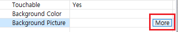

# 共通属性
それぞれのコントロールを導入する前に、コントロールの基本的な共通属性と設定値を説明します。

## <span id = "widgetID">コントロールID</span>
IDは、コントロールの一意の識別子です。各ftuファイル内で重複したIDを許可していません。他のftuファイル間、同じIDを許可します。 
IDを設定した後、コンパイルするとftuファイルに対応する**activity**のヘッダファイルが生成され、対応するヘッダーファイル内のコントロールのIDが定義されます。


コントロールからIDの取得
```c++
/**
 * The interface is defined in the control base class "ZKBase"
 * Header file location: include/control/ZKBase.h
 *
 * Note: The following interfaces, unless otherwise specified, mean that all controls defined in the ZKBase class directly or   
 * indirectly inherit the ZKBase class, so all controls can call the public interface in the ZKBase class
 */
int getID() const;

/* Operation example: Click the button control to print the ID value of the control */
static bool onButtonClick_Button1(ZKButton *pButton) {
    int id = pButton->getID();
    LOGD("onButtonClick_Button1 id %d\n", id);
    return false;
}
```

## コントロールの位置
ftuファイルから任意のコントロールを選択すると、プロパティウィンドウのLocationを介してコントロールが表示される位置を決定することができます。


 左上隅の座標は、上位のコントロールの左上隅を基準にします。
 コントロールの座標は、コードからも設定するか、現在設定された座標を得て来ることができます。

```c++
/* Interface description */
// Set location
void setPosition(const LayoutPosition &position);
// Get location
const LayoutPosition& getPosition();


/* Operation esample */
// Click the button control to set the button position
static bool onButtonClick_Button1(ZKButton *pButton) {
    // left：0，top：0，width：100，height：200
    LayoutPosition pos(0, 0, 100, 200);
    pButton->setPosition(pos);
    return false;
}

// Click the button control to get the button position
static bool onButtonClick_Button2(ZKButton *pButton) {
    // The mLeft, mTop, mWidth, and mHeight variables of pos correspond to the coordinate values respectively.
    LayoutPosition pos = pButton->getPosition();
    return false;
}
```

## 背景色


比較的簡単です。色を変更して、効果を確認してください。
ここでは、背景色を設定するコードです。

```c++
/* When color is -1, the background is set to transparent; other color values are 0xRGB, and the color value does not support alpha */
void setBackgroundColor(int color);


/* Operation example : Click the button control and set the background color to red */
static bool onButtonClick_Button1(ZKButton *pButton) {
    pButton->setBackgroundColor(0xFF0000);
    return false;
}
```

## 背景画像


画像を選択すると、ツールから直接確認が可能です。


ここでのコードを使用して、背景画像を設定する方法を説明します。
```c++
/**
 * The pPicPath parameter can have the following two ways :
 * 1. The absolute path, such as : "/mnt/extsd/pic/bg.png"
 * 2. Relative resource directory path, you only need to put the picture in the resources directory of the project, after 
 * compiling, you can use it. If there is a bg.png picture in the resource directory, just set "bg.png".
 */
void setBackgroundPic(const char *pPicPath);


/* Operation example */
mButton1Ptr->setBackgroundPic("/mnt/extsd/pic/bg.png"); // Set the absolute path
mButton1Ptr->setBackgroundPic("bg.png");    // Set the bg.png picture in the resource directory
```

## 表示/非表示


コントロールの既定の状態を表示または非表示に設定することができます。
Outlineウィンドウで、コントロールをダブルクリックすることで、このプロパティを変更することができます。


さらにコードからも表示/非表示のプロパティの変更が可能です。
```c++
void setVisible(BOOL isVisible);
BOOL isVisible() const;

/* Operation example */
mButton1Ptr->setVisible(TRUE);  // Show the button control
mButton1Ptr->setVisible(FALSE); // Hide the button control


/**
 * Window controls can also use the following interface, the same function
 * Header file location : include/window/ZKWindow.h
 */
void showWnd();  // Show window
void hideWnd();  // Hide window
bool isWndShow() const;  // Whether the window is displayed

/* Operation example */
mWindow1Ptr->showWnd();
mWindow1Ptr->hideWnd();
```

## コントロールステート
テキスト、ボタン、リストビューコントロールは、5つのステート（**Normal/ Pressed/ Selected/ Pressed and Selected/ Invalid state**）を持っており、ここでは、各ステートについて説明します。


Pressedステートは別にコードで設定する必要がなく、タッチを介して自動的に変更されます。
以下はSelectedとInvalidステートの動作例です。
```c++
// Set selected state
void setSelected(BOOL isSelected);
BOOL isSelected() const;

/* Operation sample */
mButton1Ptr->setSelected(TRUE);
mButton1Ptr->setSelected(FALSE);


/**
 * Invalid state function description: when the control is set to the invalid state, the touch control has no effect, that is, 
 * it does not respond to the press and lift event
 */
// Set invalid state
void setInvalid(BOOL isInvalid);
BOOL isInvalid() const;

/* Operation example */
mButton1Ptr->setInvalid(TRUE);
mButton1Ptr->setInvalid(FALSE);
```

## 例の説明

以下の簡単な例を、共通の属性に関連する関数について説明します。

### 1. コントロールの作成

まず、新しいFlywizOSプロジェクトを作成し、プロジェクトエクスプローラでuiフォルダのmain.ftuファイルをダブルクリックして開きます。そして右側のコントロールボックスのボタンコントロールとテキストコントロールをmain.ftuにドラッグしてコントロールを作成します。


### 2. プロジェクトのコンパイル
（詳細は、["FlywizOSプロジェクトのコンパイル」](how_to_compile_flywizOS.md＃how_to_compile_flythings)参照してください）


### 3. コントロールのプロパティ関数の呼び出し
 コンパイルが終わった後、プロジェクトのjni/ logic/ mainLogic.ccを開くと、ファイルの下端部に`onButtonClick_Button1`関数が生成されたことを確認することができます。
**この関数getID()関数を呼び出して、Button1ボタンコントロールのID値を取得し、setText()関数を呼び出してTextView1テキストコントロールに表示します。**
（[コントロールIDとコントロールのポインタ変数の関係について、より詳しく知りたい場合は、こちらをクリックしてください。](named_rule.md)）


### 4. ダウンロードとデバッグ
 Project explorerで、プロジェクト名を選択し、右クリックし、ポップアップメニューから**Download and Debug**を選択すると、プログラムがボードにダウンロードされ、実行されます。プログラムの実行後、ボタン（Button1コントロールのボタン）テキストコントロールにボタンのIDである20001が表示されることを確認します。

### Note :
<font color="#E6161E" size="4">共通属性の設定関数についての詳細を知りたい場合は、/jni/include/control/ZKBase.hファイルを参照してください</font>   
