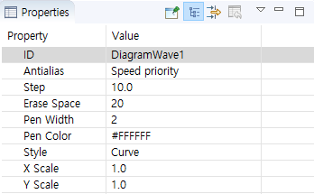

# ダイヤグラム
このコントロールを使用して、簡単に、曲線または直線ダイヤグラムを描くことができます。

## 使い方
  1. まず、UIファイルにダイヤグラムが位置する領域を決めた後** Diagram**コントロールを作成し、** Waveform**コントロールを追加すると、おおよそのダイヤグラムを確認することができます。具体的な作成手順は次のとおりです。
  
       
     
  2. 必要に応じて**Waveform**コントロールを追加して、波形を追加することができます。   
    **Note : プレビューでは、DiagramコントロールのWaveformコントロールを選択することができないため、Waveformコントロールのプロパティを確認または変更するには、outlineでwaveformコントロールを選択するしかありません。**   
       

  3. DiagramとWaveformコントロールそれぞれのプロパティを確認するとDiagramコントロールのプロパティには、波形のx、y座標の範囲と描かれる領域を決定するということがわかります。そしてWaveformコントロールのプロパティには、各波形の線のスタイルを決定します。

        

       

 Waveformコントロールのプロパティの`Step`と` Erase Space`は以下の通りです。

 * <span id = "step_property"> **Step** </span>  
    新しい波形データが一つ追加されたとき、波形が動く距離（単位：ピクセル）を表します。この値は、**x-axis zoom**属性の影響を受けます。
  * **Erase Space**  
    波形が更新されたとき**空**部分の幅を表します。
         

**上記の2つのプロパティは、すべての`void addData(int index、float data)`関数を用いて、新しい波形データを追加する場合にのみ有効です。**


## 座標とスケール

 波形全体のスケールは自動的に決定されるので、プロパティウィンドウ、x軸、y軸の範囲と表示領域のサイズだけを決定します。

 Note : Waveformコントロールの**X scaleとY scale**プロパティは、値の倍率に応じて波形がスクリーンに描かれる。基本は1.0であり、スケールされないことを意味します。波形の座標は**x-axis min value、x-axis max value、y-axis min value、and y-axis max value**によって決定されます。例えば、基本的なx-axisの範囲が[0、100]であり、y-axisの範囲が[0, 100]の場合、波形が描かれる領域の座標は以下の通りです。

   

 一般的に、**x-axis min**の値は**x-axis max**の値よりも小さい。しかし、逆に値を入れる場合、波形は同じデータを持つ波形がx軸に反転します。もし`void setData(int index、const MPPOINT* pPoints、int count)`関数を使用してデータを追加する場合は、更新されている方向も逆方向になります。また、同様のことがy軸に発生した場合、上下に反転します。

## 運営コード
  UIファイルは、唯一の波形の形だけ速く変更することができ、実際の波形は、コードを介してデータを追加する必要があります。
  プロジェクトの`jni/ include/ control/ ZKDiagram.h`で、そのためのサポート関数を参照することができます。 
  **Note : 他のコントロールとは異なり、`Waveform`コントロールもIDを持っていますが、このIDで、独立したポインタ変数が作成されません。ただ`Diagram`だけの独立したポインタ変数が作成されジービーだ。したがって、波形を調整するためには、`Diagram`コントロールのポインタを利用した次の`index`値を利用して波形を調整する必要があります。`index`は0から始まります。**

  * `void setPenWidth(int index, int width)`  
    波形の太さを設定します。プロパティウィンドウ**Pen Width**に対応します。
    
  * `void setPenColor(int index, ARGB color)`  
    波形の色を設定します。プロパティウィンドウ**Pen Color**に対応します。
    
  * `void setXScale(int index, double xScale)`  
    Y-axisのスケールを設定します。プロパティウィンドウ**X-axis Xcale**に対応します。
    
  * `void setYScale(int index, double yScale)`  
    Y-axisのスケールを設定します。プロパティウィンドウ**Y-axis Scale**に対応します。
    
  * `void setData(int index, const MPPOINT *pPoints, int count)`  
    
    ```
    typedef struct _MPPOINT
    {
        float x;
        float y;
    }MPPOINT;
    ```
    `MMPOINT`構造体は、波形データのxとyの値が含まれています。
    この関数は、`index`番目Waveformコントロールに`count`のデータを持つ`pPoints`配列にそれほどという意味です。Note：`count`値は`pPoints`の実際のサイズよりも大きくすることができません。 
    **この関数を用いて波形を描く場合** : まず、`sPoints`配列に波形データを満たし、一度に波形を更新します。 したがって、もし波形を左または右に移動効果を得たい場合は、配列全体の値を調整する必要があります。 通常、これらの場合、タイマーを使用して実装し、この関数の呼び出し時に、波形全体が更新されます。
    
  * `void addData(int index, float data)`
    波形に1つのデータを追加します。`data`はyの値であり、xの値は、[**Step**](＃step_property)によって自動的に決定されます。 `void setData(int index、const MPPOINT* pPoints、int count)`と `void addData(int index、float data)`の波形更新方式を比べると、データのサイズが大きい場合には、2番目の方法は、より効率的に波形を更新することができます。
    
  * `setData(index, NULL, 0)`      
    波形データをすべて0にクリアします。
    
    

## 波形の移動方法を追加
 前述したよう`void setData(int index、const MPPOINT* pPoints、int count)`を使用して波形を描く場合、一般的に、配列の値を直接設定する必要があります。
```c++
static void movePoints(MPPOINT* p,int size){
	for(int i =0;i < size-1;i++){
		p[i].y = p[i+1].y;
	}
	p[size-1].y = 0;
}
```

## タイマーを追加して、波形データを定期的に更新
一般的に、定期的に波形を更新するための簡単な方法として、タイマーを追加します。


# サンプルコード
プレビュー   
  

具体的な内容は、[サンプルコード](demo_download.md＃demo_download)のDiagramDemoプロジェクト参照してください。