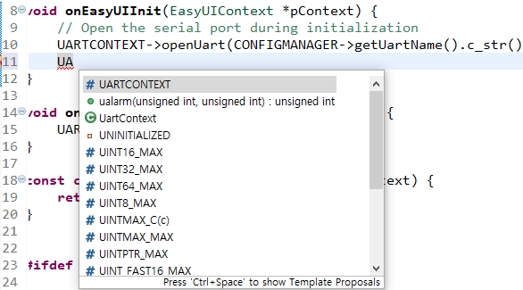

# 開発ツールのための共通の設定に

## 関連する関数に移動
 UIファイルにあまりにも多くのコントロールを追加したとき、**Logic.cc**ファイルも多くの関連する関数が生成され、これは特定のコントロールに関連する関数を探したいときは、多くの時間を消費するしかありません。
 しかし、幸いなことにFlywizOS IDEは急速にコントロールに関連するコードを探しに行くことができる機能をサポートします。
 UIファイルのエディタ画面でコントロールを選択し、右クリックでポップアップされるメニューの中**Goto relative code**をクリックすると、該当するLogic.ccファイルの関連する関数に直接移動します。

   

> **Note : この機能は、コントロールが自動的に生成された関数を持っている場合にのみ有効です。 **

---

## フォントの変更
1. 上部メニューから**Window** - >**Preferences**選択します。

      

2.  ポップアップメニューから次の図のようにフォントを変更可能です。
  
     

## コードの自動補完
 コーディング時にユーザーが先頭を入力して、「**Ctrl + Space**」キーを押すと、コード補完機能が実行されます。
 下の図のように**UA**を入力した後、「**Ctrl + Space**」キーを押すと、複数の入力のオプションがポップアップされ、キーボードのアップ/ダウンキーを利用して、必要なオプションを選択して、**Enter**キーを押すと、コードが自動的に完成します。

  

## 再 - インデックス
  もしコードの自動補完機能が失敗したり、エディタでコードエラーが見えますが、何の問題もなくコンパイルがされている場合、再 - インデックス機能を使用してください。
  再 - インデックスをする方法は以下の通りです。

   
