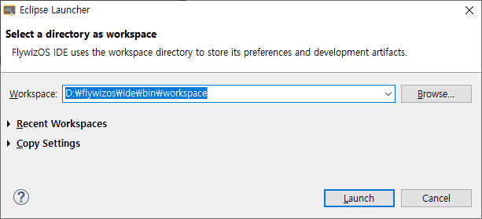
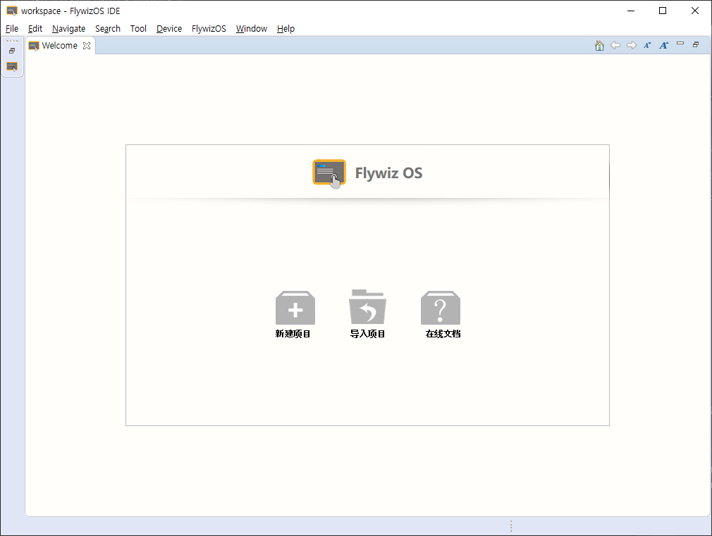

# FlywizOS IDE初めて使用
[FlywizOS IDE](download.md)が正常にインストールされると、開発者は、デスクトップの壁紙で！[ZKSW-Editor快捷方式](assets/ide/quick_link.png)のショートカットをダブルクリックして、IDEを実行します。

## Workspace選択
 IDEを実行すると、下のポップアップ画面を見ることができます。
* **Workspace**は、開発に関連した設定と履歴が保存されている空間です。この空間は、複数のプロジェクトを同時に管理するコンテナのように理解することができ、IDEを同時に複数実行する必要がありません。
      

## Welcome 画面
もし最初のIDEを実行して、workspaceを選択すると、下の図のWelcome画面を見ることができます。
この画面は2つの機能を提供しています : **New Project** , **Import Project**

  * **New Project**  
    どのように[新しいプロジェクトを作成](new_flythings_project.html)かどうかを段階的に実行します。
    
  * **Import Project**
    この機能により、既存のに作られたプロジェクトを現在のWorkspaceにインポートして、以前の開発を継続することができます。
    [プロジェクトのインポート](import_project.md)
    
      
    

  Welcome画面を再オープンをしたい場合は**メニュー**で**Help - > Welcome**を選択します。
    

​    
