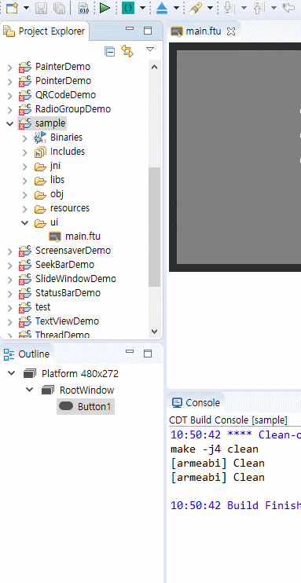
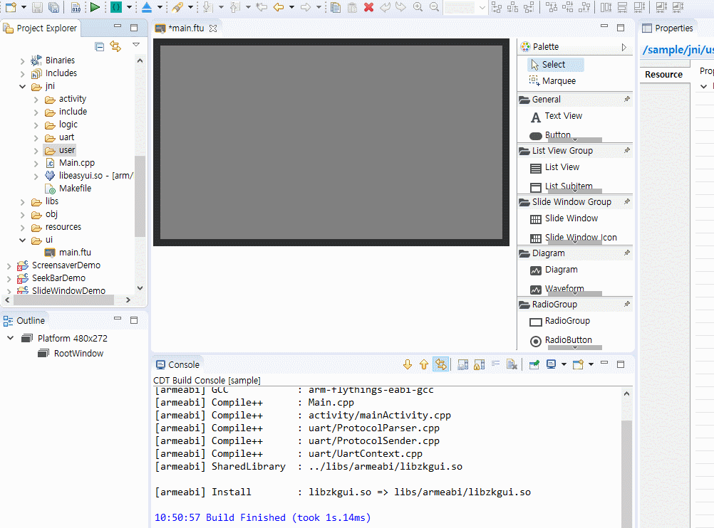

# FlywizOS プロジェクトのコンパイル
FlywizOSプロジェクトをコンパイルすることは非常に簡単であり、3つの方法でコンパイルすることができます。
## 1. Project Explorerでコンパイル
 Project Explorerでコンパイルしようとするプロジェクトを探して選択し、右クリックして、ポップアップされるメニューから**Compile Project**を選択すると、自動的にプロジェクトがコンパイルされます。以下は関連動画です。

   

## 2. Toolbarでコンパイル
IDEの上端部のツールバーにコンパイルショートカットがあります。1と同様にProject Explorerでコンパイルしようとするプロジェクトを探して選択し、そのボタンを押すと、コンパイルが行われます。

 

プロジェクトを選択した後、緑の三角形のボタンをクリックすると、コンパイルが行われます。

## 3. ショートカットでコンパイル
最も簡単な方法でコーディング中**Ctrl + Alt + Z**を押すと、すぐにコンパイルが行われます。

# プロジェクトのクリーンアップ
プロジェクトをコンパイルした後、一般的に、オブジェクトファイルと一時ファイルが残ります。たとえば、コンパイル時間が短縮のために**libs**と**obj**フォルダが残ってはっています。

  

開発者は、これらを手動で削除することもあり、メニューを介して自動的に削除することもできます。

* 手動削除  
 まず、削除するフォルダを選択して右クリックして、ポップアップされるメニューから**Delete**を選択して削除する。

  

* 自動削除  
  もし毎回手動で削除する場合は、他の重要なファイルを削除するなどのミスが発生する可能性があります。そのため、自動クリーンアップにこのような状況を防ぐことができます。同様に、まず、プロジェクトの名前を選択し、右クリックをして、ポップアップされるメニューから**Clear Project**を選択します。その後、自動的に**libs**と**obj**フォルダが削除されます。（この場合、フォルダ内のファイルは、削除され、フォルダ自体は削除されません。）

**Note: もしコンパイル中に奇妙な問題が発生したり、プログラムのソースがコンパイルされていない場合、まずClear Projectを実行して、再コンパイルを実行してください。特に、他の人のプロジェクトをインポートしてコンパイルする場合、多くの場合、これらの現象が発生することがあります。**

# Recompile
もしコードを再コンパイルしたい場合は、まずプロジェクトをクリーンアップしてコンパイルをしてください。

