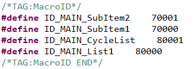

## <span id = "relation_function">コントロールによって自動的に生成された相関関数の説明</span>
一部のコントロールは、関連する関数を自動的に生成します。これらのコントロールによって生成された関連の関数の具体的な説明は次のとおりです。 

> [!Note]
> **関数で`XXXX`はコントロールIDを表すため、実際のプロセスから直接交換してください**

---
* ### Button control
   ```c++
   static bool onButtonClick_XXXX(ZKButton *pButton) {
      return false;
   }
   ```
   ボタンをクリックすると、関数が呼び出されます。
   
     * **パラメータ`ZKButton* pButton`**はクリックしてボタンのポインタです。ポインタのメンバ関数を使用してコントロールの一連の作業を行うことができます。このポインタは、グローバル変数`mXXXXPtr`が指すオブジェクトと同じオブジェクトです。

---

* ### Edit Text control
  ```c++
  static void onEditTextChanged_XXXX(const std::string &text) {
    
  }
  ```
  
  Input boxのテキストが変更されると、システムは自動的にこの関数を呼び出します。
  
    * **パラメータ`std::string＆text`**現在Input boxの完全な文字列です。

---

* ### Seek Bar control
  ```c++
  static void onProgressChanged_XXXX(ZKSeekBar *pSeekBar, int progress) {
  
  }
  ```

  Seek Barの現在のプログレス値が変更されると、システムは自動的にこの関数を呼び出します。  
  * **パラメータ`ZKSeekBar* pSeekBar`**はSeek Barコントロールのポインタであり、ポインタのメンバ関数を使用して、コントロールの一連の作業を行うことができます。
  * **パラメータ`int progress`**は、現在Seek Barのプログラス値です。

---

* ### <span id = "slidewindow"> Slide Window control</span>
  ```c++
  static void onSlideItemClick_XXXX(ZKSlideWindow *pSlideWindow, int index) {
    
  }
  ```

  Slide Windowコントロールのアイコンをクリックすると、システムが自動的にこの関数を呼び出します。
  * **パラメータ`ZKSlideWindow* pSlideWindow`**はSlide Windowコントロールのポインタであり、ポインタのメンバ関数を使用してコントロールの一連の作業を行うことができます。
  * **パラメータ`int index`**は、現在クリックされたアイコンのIndex値です。たとえば、合計10個のアイコンがSlide Windowに追加された場合Index値の範囲は[0、9]です。

---

* ### <span id = "list">List control</span>
 Listコントロールは、最も複雑なコントロールであり、3つの関連する関数を作成します。多くの機能がありますが、以下の手順に従って、理解することは非常に簡単です。    
  1. まず、システムがListコントロールを描画するにはどのように多くの項目があることを知っている。したがって、次のような関連の関数があります。   
      ```c++
        static int getListItemCount_XXXX(const ZKListView *pListView) {
              return 0;
        }
      ```   
     * **パラメータ`const ZKListView* pListView`**は、グローバル変数`mXXXXPtr`と同じオブジェクトを指しているListコントロールのポインタです。
     *  **戻り値**は定数で、List内の項目数を意味し、必要に応じて定義することができます。
    

  2. 시システムが描画するアイテムの数を知っても十分ではなく、各項目ごとに表示される内容も知っている。このため、以下の関数が提供され、提供された関数が複数回呼び出され、各項目が処理されるまで、各項目の表示内容を設定します。
      ```c++
      void obtainListItemData_XXXX(ZKListView *pListView, ZKListView::ZKListItem *pListItem, int index) {
        //pListItem->setText(index)
      }
      ```
       * **パラメータ`ZKListView* pListView`**は、グローバル変数` mXXXXPtr`と同じオブジェクトを指しているListコントロールのポインタです。
       * **パラメータ`ZKListView::ZKListItem* pListItem`**はList Itemのポインタであり、UIファイルの`Item`に対応します。
       * **パラメータ`int index`**は全体Listで`pListItem`のIndex値であり、特定の範囲があります。   
  
      **例：**`getListItemCount_XXXX`関数の戻り値は10であり、これは、Listに10個のItemがあることを意味します。その後、`index`の範囲は、`pListItem`と`index`を組み合わせて、[0、9]です。今設定したList Itemが全体Listでどこにあるか知ることができます。
      この機能では、`index`に基づいて、各Listの表示内容を個別に設定することができます。   
      **例：**関数でコメントアウトされたステートメントは、次のことを意味します。各List Itemは、そのIndex値をテキストとして表示します。

  3. Buttonコントロールと同様にListコントロールにもクリックイベントがありますがIndex値を基準に、現在クリックされたList Itemを判断します。
      ```c++
      static void onListItemClick_XXXX(ZKListView *pListView, int index, int id) {
            //LOGD(" onListItemClick_ Listview1  !!!\n");
      }
      ```
      Listコントロールをクリックすると、タッチ座標を使用してList Itemのインデックス番号を計算した後に自動的にこの関数を呼び出します。

     * **パラメータ`ZKListView* pListView`**は、グローバル変数` mXXXXPtr`と同じオブジェクトを指しているListコントロールのポインタです。

     * **パラメータ`int index`**は全体Listコントロールで現在クリックされたList ItemのIndex値です。

     * **パラメータ`int id`**は、現在クリックされたコントロールのIDです。このIDは、[プロパティ]ウィンドウIDとは異なります。これに対するマクロは、`Activity.h`ファイルに定義されています。例えば、`mainActivity.h`で  
         
      このidはList Itemに複数subItemがあるとき、現在クリックされたsubItemを区別するために使用することができます。   
      **例：**下の図のようにList Itemに2つのsubItemを追加して、スイッチボタンで画像を追加しました。属性IDは、それぞれ`SubItem1`と` SubItem2`です。`SubItem1`をクリックすると、` id`と `ID_MAIN_SubItem1`、` ID_MAIN_SubItem2`の関係を判断して、どのスイッチをクリックしたかを確認することができます。

      サンプルコード :
      ```c++
        static void onListItemClick_XXXX(ZKListView *pListView, int index, int id) {
            //LOGD(" onListItemClick_ Listview1  !!!\n");
            switch(id) {
            case ID_MAIN_SubItem1:
                //LOGD("Clicked the first subitem of item %d in the list", index);
                break;
            case ID_MAIN_SubItem2:
                //LOGD("Clicked the second subitem of item %d in the list", index);
                break;
            }
        }
      ```
         
        
