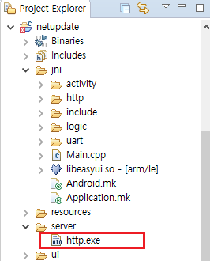

# リモートアップグレード
 現在のシステムでは、直接リモートアップグレードのためのアクティビティがありません。
 しかし、私たちは、TFカードの検出とアップグレードのメカニズムを理解し、リモートアップグレードの目的を達成するために、独自のコードを追加することができます。  
 まず、TFカードを挿入する一般的なアップグレードプロセスを紹介します。

## TFカード検出アップグレードプロセス
 システムを起動するか、TFカードを挿入するときに、[TFカードが正常に装着されている場合](tf.md)システムは、**TFカードのルートディレクトリ**に**update.img**ファイルがあることを確認します。（TFカードのルートディレクトリは、`/mnt/extsd`にマッピングされます。）  
 ファイルがある場合は、ファイルが要件を満たしていることを追加で確認します。検証に合格すると、アップグレードアクティビティが表示され、ユーザーがアップグレードを選択することができます。存在しない場合、プロセスが終了し、アクティビティにどのような行動も起こりません。

## 実装段階
1. まず、アップグレードイメージ`update.img`をダウンロードする必要があります。
    通常の状況下では、HTTPプロトコルを介してファイルをダウンロードすることが最も簡単な方法であり、実際の状況に応じて、他のプロトコルを選択することもできます。
    ダウンロードした後の画像ファイルをTFカードのディレクトリ`/ mnt/extsd/`に保存します。
  > [!Note]
  > ボードにTFカードが挿入されていない場合でも、このディレクトリは、メモリに保存されるので書くことができます。メモリサイズによって制限され、画像ファイルが大きすぎる場合、異常な動作やアップグレードが失敗の原因になります。  
  TFカードを挿入した場合、メモリサイズの問題を無視することができます。

2. アップグレード検出関数の呼び出し 
    First, download the [UpgradeMonitor.h] (https://developer.flywizos.com/src/UpgradeMonitor.h) source file and save it in your project's `jni/include/os` directory.

   

   次に関数を呼び出して、アップグレードを検出してください。
   ```c++
   #include "os/UpgradeMonitor.h"
   ```
   ```c++
   //Actively detect whether there is a correct update.img file in the /mnt/extsd directory,
   //If yes, an upgrade prompt box will pop up
   //If not, nothing happens
   UpgradeMonitor::getInstance()->checkUpgradeFile("/mnt/extsd");
   ```
   アップグレードアクティビティが表示され、ユーザーがアップグレードするかどうかを選択することができます。
   これまでのリモートアップグレード機能が完全に実現された。
   

## ファイルのダウンロード後、自動更新
 アップグレードファイルをダウンロードした後、強制的に更新するには、[自動更新]（autoupgrade.md）文書を参照して、コードで`zkautoupgrade`ファイルを作成するだけです。


## 反復的なアップグレードを防止
 上記の手順で画像ファイルを`/mnt/extsd/`ディレクトリに保存します。正常にアップグレードすると、ボードは自動的に再起動されます。
 この時、システムは、定期的なアップグレードを検出プロセスを実行し、画像ファイルが存在するため、アップグレードアクティビティが再びポップアップされ、アップグレードが繰り返されます。

### 解決
イメージファイルをダウンロードするときに`/mnt/extsd/`ではなく、別のディレクトリに保存します。例：`/mnt/extsd/temp/`、また、検出関数の呼び出し時のパラメータも変更します。

```c++
UpgradeMonitor::getInstance()->checkUpgradeFile("/mnt/extsd/temp");
```


## Sample
[Complete sample download](https://docs.flythings.cn/src/netupdate.zip)  
サンプルは、単にhttpクライアントを実装して、ファイルをダウンロードします。ソースコードのhttpの部分を参照してください。ファイルのダウンロードは、時間のかかる作業なので、インターフェースの即時応答に影響を与えないように、ファイルを別のスレッドに配置してください。

  
* キーコード
  ```c++ 
    class DownloadThread : public Thread {
        protected:
        virtual bool threadLoop(){
            http::HttpClient http;
            mTextview1Ptr->setText("Download the upgrade file");
            //Create a save path for the upgrade file
            system("mkdir /mnt/extsd/temp");
            //Modify here to the real service IP
            string err = http.Download("192.168.1.1/update.img", 80, "/mnt/extsd/temp/update.img");
            mTextview1Ptr->setText(err);
            if (err.empty()) {
                UpgradeMonitor::getInstance()->checkUpgradeFile("/mnt/extsd/temp");
            }
            mButton1Ptr->setInvalid(false);
            return false;
        };
    };
  ```

* サーバーの実装  
  テストの便宜のために例には、実行ファイルである`http.exe`が含まれています。
  
    
  
   作成されたアップグレードイメージファイル`update.img`と`http.exe`を同じフォルダに入れ、`http.exe`をダブルクリックして実行します。ネットワークが正常であれば、Webサイトのミラーファイルを使用して同じディレクトリにファイルをダウンロードすることができます。
  
  例 :  
  http://192.168.1.1/update.img    
  (IPアドレスをコンピュータの現在のIPに変更します。)  

サーバーが開始された後、サンプルコードを実行して、リモートアップグレードをテストします。
