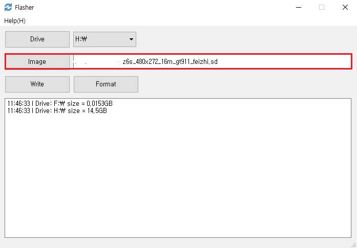
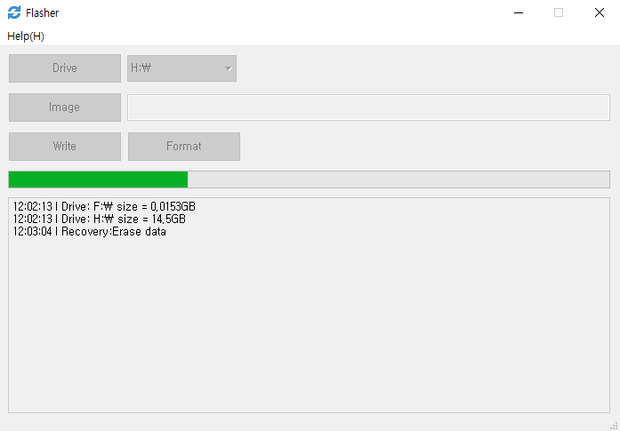

​      
##  フラッシュカードを作成する
>[!Warning]
>**注：TFカードの最大容量は、16Gをサポートします。16G以上のTFカードは認識することができず、アップグレードができません。
>最新のソフトウェア更新プログラムパッケージは、QQ[371608200](//shang.qq.com/wpa/qunwpa?idkey=da6e12d1773a7e55295a0accd2a46ad51aece61657fe55a2f8277f4cd91dc56a)からダウンロードしてください。 ダウンロード時のボードに対応したソフトウェアのバージョン（ボードの背面[Tag](board_tag_explain.md)を確認）を確認してください。もし、他のバージョンが使用されると、アップグレード後正常動作しない場合があります！**

1. [Computer Flash Tool](http://download.zkswe.com/tool/Flasher.zip) ダウンロードします。    

2. コンピュータでTFカードドライブを選択します。    
       
    
3. アップグレードイメージファイルを選択します。    
       

4. 製作のためにクリック    
       
       
       
    
5. プログラミングが成功した場合のTFカードを取り出し、ボードに挿入し、再度電源を入れてアップグレードしてください。

## TFカードの回復
1. コンピュータでTFカードドライブを選択します。    
     
    
2. カードの回復をクリックします。    
       
       
       

3. フォーマット後のカードは、通常の使用が可能です。

