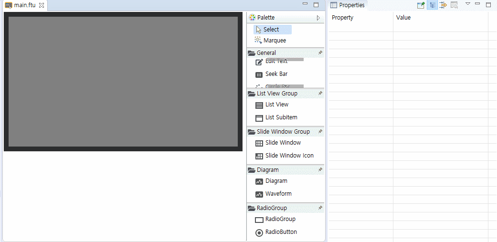

# Seek Barコントロール
## Seek Barコントロールの使い方
多くの場合、Seek Barを使用します。たとえば、次のとおりです。
**Volume調整**  
  

いくつかの簡単な図を使用してこの効果を迅速に得ることができます。
1. まず、4つの画像を準備します。
  * Background picture    
      
  * Valid picture  
    
  * Thumb - normal picture   
     
  * Thumb - pressed picture  
    

2. IDEでSeek Barコントロールを作成します。

 
  コントロールを作成する方法がわからない場合、[Buttonコントロールの作成](＃add_button)を参照してください。

3. 基本Seek Barスタイルは透明で正常に動作するには、十分な画像リソースを追加する必要があります。
    プロパティウィンドウで、**Valid Picture、Thumb-Normal Picture、Thumb-Pressed Picture、Background Picture**画像を設定します。

      
4. 前のステップが完了すると、基本的にはSeek Bar生成が完了します。IDEでSeek Barのスライド効果をプレビューするには**Max Value**属性と**Default Progress**属性を変更します。プレビューで、スライダー、カーソルの位置の変更を見ることができます。
    

## コードでSeek Barのプログラスを制御する方法は何ですか？Seek Barの現在のプログレス値を確認する方法は何ですか？
 Seek Barを使用してVolume Barを実装する場合、現在のVolume Barのプログレス値を把握し、Volume Barが変更されると同時に、ボリュームも調整する必要があります。
 したがって、これらの問題を解決するために、以下の3つの関数があります。

1. `static void onProgressChanged_XXXX(ZKSeekBar *pSeekBar, int progress)`
    プログラス値の変更を監視関数
    UIファイルにSeek Barコントロールを作成した後、コンパイルすると、この関数はその`XXXXLogic.cc`ファイルに自動的に追加されます。
    タッチスクリーンでSeek Barを押すか、またはプログラスの現在の値が変更されると、システムはこの関数を自動的に呼び出します。
    ``` C++
    static void onProgressChanged_XXXX(ZKSeekBar *pSeekBar, int progress) {
      //LOGD("XXXXThe progress value of the seek bar changes to %d !\n", progress);
    }
    ```
2. `void setProgress(int progress)`  
    Seek Barの現在のプログレス値を設定するために使用されます。例 :
    ``` C++
    //Set the seek bar progress to 28
    mSeekbarPtr->setProgress(28)
    ```
3. `int getProgress()`  
    現在Seek Barのプログレス値を取得するために使用されます。例 :
    ``` C++
    int progress = mSeekbarPtr->getProgress();
    LOGD("The current progress value of the seek bar %s", progress);
    ```


## 例 
詳細については、[Sample Code](demo_download.md＃demo_download)のSeekBarDemoプロジェクトを参照してください。  
例のプレビュー :  


