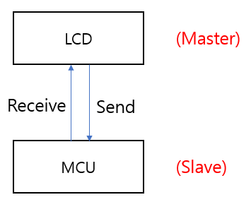

# 시리얼 포트 소개
 아래 그림은 가장 간단한 통신 모델입니다. LCD와 MCU는 시리얼 포트를 통해 통신하며 정해진 프로토콜로 서로 상호 작용할 수 있습니다.

 여기서 주목할 점이 있는데, 기존의 시리얼 포트 LCD는 슬레이브 장치로 사용되고 MCU를 통해 해당 명령을 전송하여 제어합니다. 그러나 FlywizOS의 시리얼 포트 LCD는 호스트처럼 자체적으로 운영이 가능하며 상호 작용할 수 있습니다.

 通信に関するコードを最初から開発するには、多くの時間がかかることがあります。開発プロセスを簡素化し、開発者がビジネスロジックの開発に、より多くの注意を払うことができるようFlywizOS IDEは、新しいプロジェクトを作成するときに自動的にシリアル通信コードを生成します。 

 同時にプロトコルデータとアクティビティの相互作用のためのコールバックインタフェースも提供しています。

 開発者は、UIアクティビティのデータの表示にもっと注意を払うことができるよう、通信部は、フレームワークによって自動的に行われます。
 通信フレームワークのプロトコル解析部は、開発者が使用する通信プロトコルに応じて変更する必要があり、[通信フレームワークの説明](serial_framework.md)の次の章では、ウォンリグァ修正が必要な部分について集中的に調べてみましょう。[シリアル通信の例](serial_example.md)の章では、いくつかの例を介して通信フレームワークの理解を深めます。