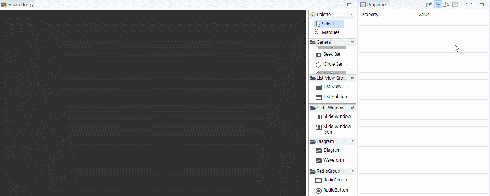
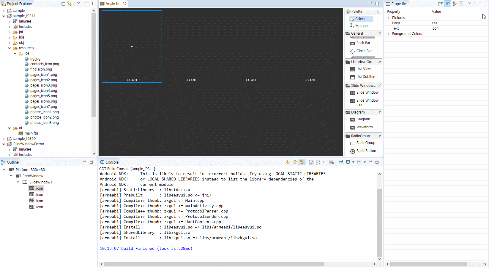

# Slide Windowコントロール
 Slide Windowコントロールは、携帯電話のメインインタフェースで左右にスライドするインターフェイスの効果と似ています。スライディングメインウィンドウ複数のアイコンで構成されます。


## 使い方
1. まず、UIファイルに**Slide Window**コントロールを作成し、**Slide Window icon**コントロールをいくつか追加します。

   

2. **Slide Window icon**コントロールを追加すると、アイコンが順番に自動的にソートされます。もし1つのページに追加が完了した後も追加すると、ページが自動的に進みます。追加されたすべてのアイコンのコントロールは、**Outline**で見つけることができます。

      

    **Slide Window Icon**の位置を調整するには、Outlineでノードを選択し、ドラッグして手動で調整することができます。下のアニメーションの左下にあるOutlineの動作に注意してください。

    

3. **Outline**で**Slide Window Icon**コントロールを選択すると、画像を追加して、テキストを個別に変更することができます。**Slide Window**を選択して、行と列の数を調整し、**フォントサイズ、アイコンのサイズ**を均一に調整することもできます。

      


## コードの操作  

1. Slide Windowコントロールを追加すると、コンパイル後に自動的に相関関数が生成され、詳細な機能の説明は、[スライドウィンドウ相関関数](relation_function.md＃slidewindow)を参照してください。

2. 一般的な状況では、タッチしてスライドして上下にスクロールするだけです。しかし、ページめくり機能も提供します。
  * 次のページに切り替え
    ```c++
    // Switch to the next page with animation
    mSlideWindow1Ptr->turnToNextPage(true);
    // Switch to the next page without animation
    mSlideWindow1Ptr->turnToNextPage(false);
    ```
  * 前のページに切り替え
    ```c++
    // Switch to the previous page with animation
    mSlideWindow1Ptr->turnToPrevPage(true);
    // Switch to the previous page without animation
    mSlideWindow1Ptr->turnToPrevPage(false);
    ```
3. Slide Windowがコードを介して任意のページに切り替えていることを監視することもできます。 
    ```c++
    namespace { // Add an anonymous scope to prevent multiple source files from defining the same class name and conflict at
        		// runtime
    // Implement your own listening interface
    class MySlidePageChangeListener : public ZKSlideWindow::ISlidePageChangeListener {
    public:
        virtual void onSlidePageChange(ZKSlideWindow *pSlideWindow, int page) {
            LOGD("Now switch to page %d", page);
        }
    };
    }
    // Define the listening object
    static MySlidePageChangeListener sMySlidePageChangeListener;
    
    static void onUI_init() {
        mSlidewindow1Ptr->setSlidePageChangeListener(&sMySlidePageChangeListener);
    }
    ```
    
4. 現在のページの読み込み
    ```c++
    int i = mSlideWindow1Ptr->getCurrentPage();
    LOGD("Current page %d", i);
    ```


# Sample code

   

詳細については、[Sample Code](demo_download.md＃demo_download)のSlideWindowDemoプロジェクトを参照してください。

