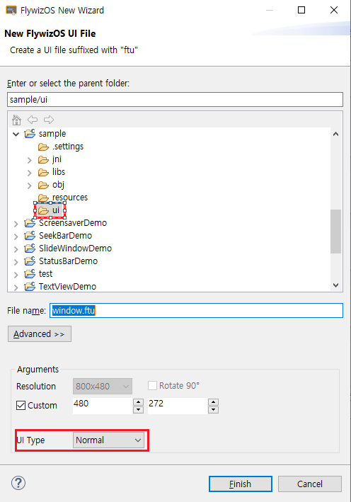

# システムアクティビティ
  IDEを使用して新しいUIファイルを作成するときに、デフォルトUIタイプは**Normal**であり、一般的な状況では、十分です。

 

 いくつかのシーンでのUIアクティビティの上に浮いている表示領域が必要な場合**Normal** UIファイルはタスクを実行することができません。他のいくつかの種類のUIファイルを使用します。
 **UI Type**オプションには、3つの特殊なタイプのオプションがあります。この3つの特殊なタイプには、次に該当する特別なファイル名があります。

* **statusbar.ftu**
* **navibar.ftu**
* **screensaver.ftu**  

  

OKをクリックすると、IDEが自動的にコードを生成します。この3つのタイプのアクティビティの作業は、一般的なアクティビティの作業と同じです。

## Status bar
 説明：このStatus barはAndroidとiOSの携帯電話のステータスバーと同じ概念でUIの上に浮かぶ、通常の表示領域です。一般的に、いくつかの共通の情報を表示したり、復帰ボタンまたはホームボタンなどを配置するために使用されます。 


システムは、Status barを操作するために使用できる2つのインタフェースを提供します。
Show status bar：

```c++
EASYUICONTEXT->showStatusBar();
```
Hide status bar：
```c++
EASYUICONTEXT->hideStatusBar();
```
完全なコードは、[**Sample Code**](demo_download.md＃demo_download)の**StatusBarDemo**プロジェクトを参照してください。

## Navigation bar
 説明：このNavigation barは、Android携帯電話のNavigation barと同じ概念を持っており、一般的にページの下部にあるUIの上に浮かぶ一般的なタスクまたは表示領域です。一般的に、いくつかの操作キーを表示するために使用されます。Navigation barは、実際にStatus barと変わりません。

Show navigation bar：
```c++
EASYUICONTEXT->showNaviBar();
```
Hide navigation bar：
```c++
EASYUICONTEXT->hideNaviBar();
```

## Screensaver
 説明：Screensaverアプリケーションは、ユーザーが一定時間の間、システムと相互作用していない場合、システムが自動的にページを開きます。
 プロジェクトを右クリックし、プロパティを選択します。ポップアップのプロパティボックスで、スクリーンセーバータイムアウトを秒単位で設定することができます。-1は、スクリーンセーバーがないことを意味します。
 コードを使用して、いくつかの設定をすることもできます。jni/include/entry/EasyUIContext.hを参照してください。

* 必要なヘッダファイル
 ```c++
 #include "entry/EasyUIContext.h"
 ```

* Screensaver timeout時間設定
```c++
//Set the screensaver timeout time to 5 seconds
EASYUICONTEXT->setScreensaverTimeOut(5); 
```

* Screensaver許可するかどうかの設定

  ```c++
  EASYUICONTEXT->setScreensaverEnable(false); //Turn off screensaver detection
  EASYUICONTEXT->setScreensaverEnable(true); //Turn on screensaver detection
  ```
  > Application scenario: If the upgrade interface cannot enter the screensaver mode, you can turn off the screensaver detection in the upgrade application EASYUICONTEXT->setScreensaverEnable(false).
  
* Screensaver実行
```c++
EASYUICONTEXT->screensaverOn();
```

* Screensaver終了
```c++
EASYUICONTEXT->screensaverOff();
```

* 現在Screensaverが動作していることを確認
```c++
EASYUICONTEXT->isScreensaverOn();
```

詳細については、[**Sample Code**](demo_download.md＃demo_download)の**ScreensaverDemo**プロジェクトを参照してください。
