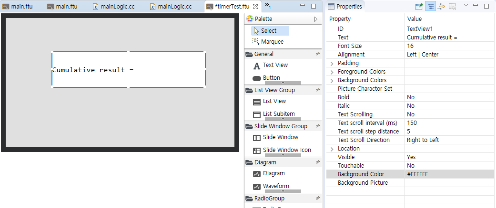

# <span id = "timer">タイマー</span>
 いくつかの場合には、定期的に、特定のタスクを実行する必要があります。例えば、定期的にハートビートパケットを送信、定期的にデータを照会してUIを更新したり、いくつかのポーリングタスクを実行します。これらの要件がある場合は、タイマーが良い選択です。

## タイマーの使い方
1. タイマー  
  使いやすさのために構造体を満たす形でタイマーを追加します。
  Logic.ccファイルには、基本的に次のような構造体の配列があります。
     
   ```c++
   /**
    * Register timer
    * Just add to this array
    */
   static S_ACTIVITY_TIMEER REGISTER_ACTIVITY_TIMER_TAB[] = {
     //{0,  6000}, //Timer id=0, Period 6second
     //{1,  1000},
   };
   ```
   타이머를 추가하려면 이 구조체 배열에 값을 추가하기 만 하면됩니다.
   이 구조체의 정의는 다음과 같습니다.
    
   ```c++
   typedef struct {
     int id; // Timer ID, can not redefine
     int time; // Timer period unit/ms
   }S_ACTIVITY_TIMEER;
   ```

2. タイマーロジックコードを追加 
   配列にタイマーを登録した後、タイマーがトリガされると、システムは、** Logic.cc**ファイルの `void onUI_Timer(int id)`関数を呼び出します。このタイマーのすべての作業のコードは次のとおりです。この関数に必要なコードを追加します。

   ```c++
   /**
    * Timer trigger function
    * It is not recommended to write time-consuming operations in this function, otherwise it will affect UI refresh
    * @param id
    *         The id of the currently triggered timer is the same as the id at registration
    * @return true
    *             Keep running the current timer
    *         false
    *             Stop running the current timer
    */
   static bool onUI_Timer(int id){
     switch (id) {
       default:
   	     break;
     }
     return true;
   }
   ```

    この関数は、基本的に** Logic.cc**ファイルに生成されます。
    構造体の配列で定義された** id**の値と関数のパラメータ** id**は同じで、** id**の値に応じて、必要な操作をすることができます。

> [!Note]
> **注：各アクティビティのタイマーは独立しており、他のアクティビティのタイマーのIDは同じことができます。**   
> **アクティビティが破壊されない限り、登録されたタイマー([アクティビティのライフサイクル](activity_life_cycle.md)参照)は、常に実行されます。**  
> **登録後に手動で停止する必要はありませんアクティビティが終了すると、自動的に停止します。**

##  例
 次に、具体的な例を挙げタイマーの使用を説明します。
 整数の変数があり、毎秒1ずつ増加し、その結果を画面に表示する関数を実装する必要があるとしましょう。
 具体的な実装プロセスは、次のとおりです。

1. まず、UIファイルにText Viewコントロールを追加して、蓄積された結果を表示します。   
      

2. タイマーを登録して**mainLogic.cc**のタイマー配列に構造を追加します。タイマーのIDは1であり、時間間隔は1秒です。時間の単位はmsです。
    
    
3. **mainLogic.cc**で静的定数変数を定義して、0に初期化します。   
      

4. `void onUI_Timer(int id)`関数で増加コードを追加して、Text Viewコントロールに表示します。   
    

5. コンパイル後、ダウンロードして実行します。   
      

## Sample code  
 詳細については、[Sample Code](demo_download.md＃demo_download)の`TimerDemo`プロジェクトを参照してください。

