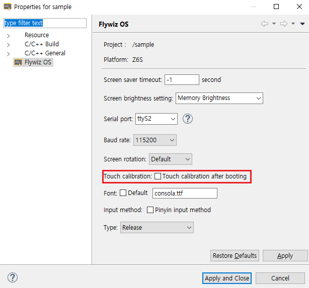

# タッチ補正
 圧力式タッチスクリーンは、最初点灯した場合、タッチ補正が行われます。タッチ補正アクティビティは、次のとおりです。


タッチを補正するには、「十字アイコン」をクリックします。今後再び補正したい場合には、次の3つの方法があります。
1. IDEを使用して、プロジェクトのプロパティを開いて、**Touch calibration after booting**オプションをチェックして、電源を入れるたびに、タッチ補正アクティビティが実行されるようにします。
      

2. TFカードのルートディレクトリに**zktouchcalib**ファイルを作成します（注：ファイルには、拡張子がない）。カードを挿入すると、タッチ補正アクティビティに入ります。
      

3. 次のコードで、タッチ補正アクティビティを開始します。
```c++
EASYUICONTEXT->openActivity("TouchCalibrationActivity");
```
