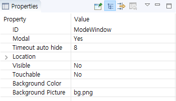

# Window
## 機能説明
Windowは、実際にコンテナであり、すべてのコントロールを含むか、または新しいWindowを再含めることができ、次のようなシナリオで使用することができます。

* コントロールの組み合わせの表示と非表示に
* タブページを完成するときに、複数のWindowを介して他のWindowの間を切り替えることができます。
* ポップアップダイアログボックス

## 使い方
1. **Window**コントロールを作成します。基本Windowは透明です。背景画像を追加したり、必要に応じて背景色を変更することができ、Windowに他のコントロールを追加することもできます。
   

2. 上記のプロパティ]ウィンドウには、説明しなければなら2つのプロパティがあります。
  * **Modal**  
    モーダルである場合、このWindowコントロールが表示されるWindow外側をクリックすると、ウィンドウが自動的に非表示になります。  
    モーダルでない場合、ウィンドウコントロールの表示/非表示を独自に制御する必要があります。
  * **Timeout auto hide**  
    モーダルWindowの場合Windowは表示開始から計算を開始し、指定された時間が経過すると、自動的に非表示になります。単位は秒であり、値が-1の場合、自動的に隠されていないことを意味します。  
    非モーダル場合は、この属性は効果がありません。

## コードの操作
Windowコントロールの場合、一般的に、次の関数が含まれます。
```C++
//Show window
void showWnd();
//Hide window
void hideWnd();
//Determine whether the window is displayed
bool isWndShow();
```

## 動的に背景の設定
画面全体にWindowを展開して、このWindowの背景を設定すると、画面の背景を変更するに効果を得ることができます。
* 関連する関数
  ```c++
  /**
   * @brief Set background picture
   * @param pPicPath Picture path
   */
  void setBackgroundPic(const char *pPicPath);

  /**
   * @brief Set background color
   * @param color When -1, the background is set to transparent; other color values are 0xRGB,  * and the color value does not support alpha
   */
  void setBackgroundColor(int color);
  ```
  
* 使用例
  ```c++
  //Set the image of the path /mnt/extsd/bg.png as the background image of this window control
  mWindow1Ptr->setBackgroundPic("/mnt/extsd/bg.png");
	
  //Set the background color of the window with ID window1 to red
  mWindow1Ptr->setBackgroundColor(0xff0000);
    
  //Set the background color of the window with ID window1 to green
  mWindow1Ptr->setBackgroundColor(0x00ff00);
        
  //Set the background color of the window with ID window1 to blue
  mWindow1Ptr->setBackgroundColor(0x0000ff);
  ```
	
  多くのコントロールには、背景色と背景画像を設定するインターフェイスがあり、方法は同じです。
	

# Sample code
 

詳細については、[Sample Code](demo_download.md＃demo_download)のWindowDemoプロジェクトを参照してください。