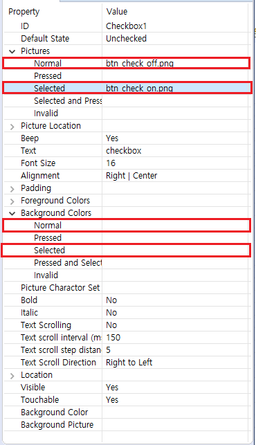

# 체크박스
 체크박스 컨트롤의 기본은 버튼 컨트롤입니다. 만약 스위치 버튼이나 체크 버튼과 같이 클릭 시 버튼의 상태가 변화되고, 클릭을 해제해도 이를 유지할 필요가 있다면 체크박스 컨트롤을 이용하여 더 쉽게 구현 가능합니다. 


## 사용법

1. 프로젝트 창에서 체크박스를 추가하고자 하는 액티비티의 UI을 더블 클릭합니다.

2. 오른쪽의 컨트롤 박스에서 `Checkbox` 컨트롤을 선택합니다.

3. `Checkbox`컨트롤을 마우스 왼쪽 클릭 후 드래그하여 버튼을 만들 위치에 놓으면, 자동으로 컨트롤이 만들어집니다.

4. 만들어진 버튼을 마우스 왼쪽 클릭하면 속성 창에서 해당 버튼과 관련된 속성들을 확인하고, 변경할 수 있습니다.
   
   버튼 컨트롤과 마찬가지로 이미지의 크기는 기본적으로 체크박스 컨트롤 크기를 따라가며, 필요한 경우 위치와 크기를 속성에서 조정 가능합니다.   
      

5. 속성 설정 후 컴파일하면 해당하는 `Logic.cc` 파일에 관련된 함수가 생성됩니다. 그리고, 해당 컨트롤을 클릭 시 시스템에서 관련된 함수를 자동으로 호출한다.
   해당 함수의 파라미터 중 `bool isChecked`는 컨트롤의 선택 상태를 나타냅니다.
   ```c++
   static void onCheckedChanged_Checkbox1(ZKCheckBox* pCheckBox, bool isChecked) {
     if (isChecked) {
       //Check box is selected
       LOGD("checked");
     } else {
       //Checkbox is unselected
       LOGD("unchecked");
     } 
   }
   ```

6. 실제 보드에 다운로드 후 테스트해 보십시오.


## 예제 코드

[Sample code](demo_download.md#demo_download)의 CheckBoxDemo 프로젝트를 참고하십시오.   
예제 코드 실행 결과 프리뷰 :   

