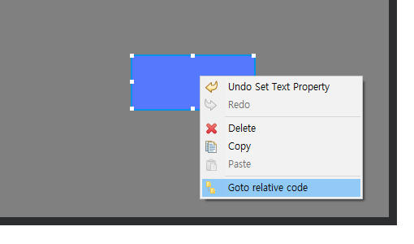
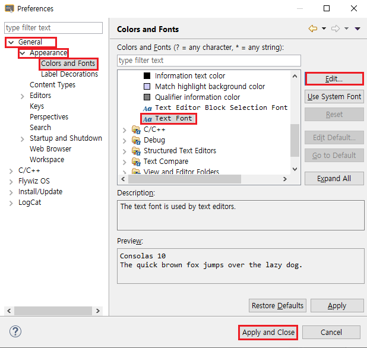

# 개발 툴을 위한 공통 설정들
## 관련 함수로 이동
UI 파일에 많은 컨트롤을 추가하면 **Logic.cc**파일 역시 많은 관련 함수들이 생성되고, 이는 특정 컨트롤과 관련된 함수를 찾고 싶을 경우 많은 시간을 소모할 수 밖에 없습니다. 그러나 다행히 FlywizOS IDE는 빠르게 컨트롤과 관련된 코드를 찾아갈 수 있는 기능을 지원합니다.  
UI파일의 에디터 화면에서 컨트롤을 선택 후 오른쪽 클릭으로 팝업되는 메뉴 중 **Goto relative code**를 클릭하면 해당하는 Logic.cc파일의 관련된 함수로 바로 이동합니다.  

> **Note : 이 기능은 해당 컨트롤이 자동으로 생성되는 함수를 가지고 있는 경우에만 유효합니다. **

---

## 폰트 변경
1. 상단 메뉴에서 **Window** -> **Preferences** 선택합니다.  

2.  팝업 메뉴에서 아래 그림처럼 폰트를 변경 가능합니다.    

## 코드 자동 완성 
코딩 시 사용자가 시작 부분을 입력하고 "**Ctrl + Space**" 키를 누르면 코드 자동 완성 기능이 실행됩니다. 
아래 그림처럼 **UA**를 입력 후  "**Ctrl + Space**"키를 누르면 다중 완성 옵션이 팝업되고, 키보드의 업/다운키를 이용하여 원하는 옵션을 선택하고 **Enter**키를 누르면 코드가 자동으로 완성됩니다.

## 재-색인
만약 코드 자동 완성 기능이 실패하거나 에디터에서 코드 에러가 보이지만 아무 문제 없이 컴파일이 되는 경우 재-색인 기능을 사용 하십시오.
재-색인을 하는 방법은 아래와 같습니다.

   
