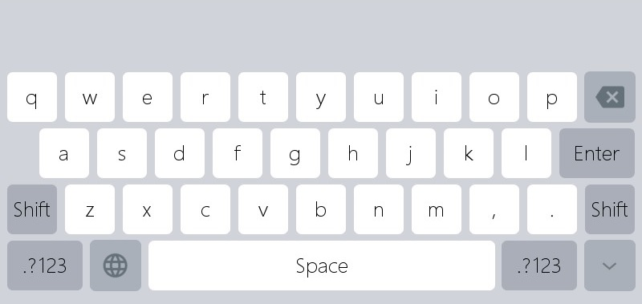

# Edit Text
## 만약 숫자 키보드가 필요거나 사용자가 텍스트를 입력할 수 있게 하려면 어떻게 해야할까요?
## <span id = "add_edit_text">Edit Text box 추가하기</span>
 만약 숫자나 텍스트 입력이 필요하다면, `Edit Text`컨트롤을 이용해서 빠르게 구현할 수 있습니다. 그 과정은 아래와 같습니다.
1. 프로젝트 창에서 버튼을 추가하고자 하는 액티비티의 UI을 더블 클릭합니다.

2. 우측의 컨트롤 박스에서 `Edit Text`컨트롤을 선택합니다.

3. `Edit Text`컨트롤을 마우스 왼쪽 클릭 후 원하는 위치에 클릭하거나 드래그 앤 드롭하면 컨트롤이 만들어집니다.

4. 만들어진 버튼을 왼쪽 클릭하면 속성 창에서 해당 버튼과 관련된 속성들을 확인하고, 변경할 수 있습니다.

5. 프로그램을 보드에 다운로드해서 실행 후 `Edit Text` 컨트롤을 터치하면 내장된 가상 숫자 키보드나 가상 텍스트 키보드가 자동으로 팝업되며, 이를 통해 숫자나 텍스트를 입력할 수 있습니다.
             

    내장 가상 텍스트 입력 키보드   
        

    내장 가상 숫자 입력 키보드
    

기본 `Edit Text`는 흰색이며, 속성 창을 통해 사용자가 원하는 스타일로 변경이 가능합니다. `Edit Text`와 관련된 속성은 다음과 같습니다.
  * **Password**  
    만약 "Yes"를 선택하면 키보드 입력 시 표시되는 텍스트가 `Password Char`로 표시되고, "No"일 경우 입력한 텍스트가 표시됩니다.
    
  * **Password Char**  
    `Password`가 "Yes"일 경우 키보드 입력 시 표시되는 텍스트를 설정합니다. 기본적으로 "*"가 표시됩니다.
    
  * **Input Type**   
    입력 형식은 2가지가 있습니다.   
     * Text - 영어 또는 숫자를 입력할 수 있습니다.    
     * Number - 숫자만 입력이 가능합니다.
    
  * **Hint Text**  
    아무런 입력이 없을 경우 자동으로 표시되는 텍스트를 설정합니다.
    
  * **Hint Text Color**  
    **Hint Text**의 색을 설정합니다. 
    
    

## 가상 키보드로부터 입력된 컨텐츠 가져오기
`Edit Text`컨트롤을 성공적으로 완성 후 컴파일하면 이와 관련된 함수들이 자동으로 생성됩니다. 프로젝트 디렉토리에서 `jni/logic/****Logic.cc`파일을 열면 해당 함수를 찾을 수 있습니다.

```C++
static void onEditTextChanged_XXXX(const std::string &text) {
	  //LOGD("The current input is %s \n", text.c_str());
}
```
가상 키보드로 텍스트를 입력하면 시스템은 자동으로 해당 함수를 호출하고, `text`파라미터를 통해 현재 입력된 컨텐츠가 전달됩니다.   
`std::string` 은 C++의 string이며, 사용자는 아래의 예제처럼 string 포인터를 가져올 수 있습니다. 

```C++
const char* str = text.c_str();
```


## 입력된 컨텐츠 숫자로 전환
`Edit Text`와 관련된 함수로는 문자로만 획득이 가능합니다. 그래서 숫자를 입력해도 문자 획득되기 때문에 이를 숫자로 바꿀 필요가 있습니다.

* `atoi`함수는 문자를 숫자로 바꿀 수 있습니다. 예를들어,  문자 "213"은 정수`213`으로 바꿀 수 있습니다.  
  만약 숫자로 변경할 수 없는 문자가 입력되면, 전환이 실패할 수 있습니다.
  
  예 :  
  `atoi("213abc");` return `213`  
  `atoi("abc");`  return `0`
  ```C++
  static void onEditTextChanged_EditText1(const std::string &text) {
    int number = atoi(text.c_str());
    LOGD("String to number = %d", number);
  }
  ```
* `atof`는 문자를 부동 소수점 수로 전환하는 함수입니다. 예를 들어, "3.14"는 부동 소수점 수`3.14`로 전환됩니다.  
  만약 부동 소수점 수로 변경할 수 없는 문자가 입력되면, 전환이 실패할 수 있습니다.
  
  예 :  
  `atoi("3.14abc");` return `3.14`  
  `atoi("abc");`  return `0`
  ```C++
  static void onEditTextChanged_EditText1(const std::string &text) {
    // The atof function can convert a string to a corresponding floating point number, for example, "3.14" can be converted to an   // integer 3.14
    // If the parameters are not standardized, the conversion will fail, and the number 0 will be returned uniformly
    double f = atof(text.c_str());
    LOGD("Convert string to floating point = %f", f);
  }
  ```

## 커스텀 입력기
 기본 입력 방법에 추가적으로 사용자가 원하는 형태의 입력기를 만들 수 있습니다. [**Sample Code Package**](demo_download.md#demo_download)의 **ImeDemo** 프로젝트에서 그 예를 찾아볼 수 있습니다. (현재는 문자와 숫자만 제공됩니다.)

보통 입력기와 커스텀 입력기의 차이는 아래와 같습니다.
1. 보통 입력기는 `Activity`를 상속받아 구현되지만, 커스텀 입력기는 `IMEBaseApp`의 상속이 필요합니다.
2. 추가적으로 등록 방법에 차이가 있습니다. 보통 입력기는 `REGISTER_ACTIVITY(****Activity);`를 통해 등록되지만, 커스텀 입력기는 `REGISTER_SYSAPP(APP_TYPE_SYS_IME, ****Activity);`를 통해 등록됩니다.(*\***는 UI파일 이름)

 **ImeDemo**프로젝트를 수정해서 사용자만의 커스텀 입력기를 만들 수 있습니다.
1. 먼저 `UserIme.ftu`파일을 사용자 프로젝트의 ui디렉토리에 복사합니다.
2. `UserImeActivity.h`와 `UserImeActivity.cpp`를 사용자 프로젝트의 activity 디렉토리에 복사합니다.
3. `UserImeLogic.cc` 파일을 사용자 프로젝트의 logic 디렉토리에 복사합니다.

이후 `UserImeLogic.cc`파일을 사용자에 요구에 맞게 수정합니다.