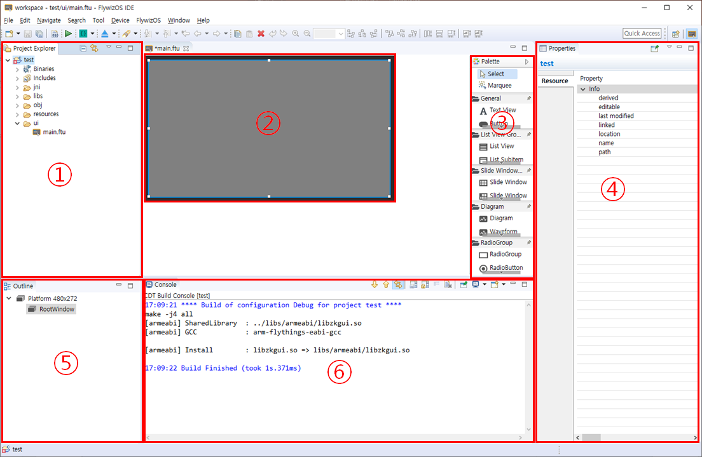

#  FlywizOS IDE의 작업 영역  
 새로운 프로젝트가 만들어지면, 아래의 화면을 볼 수 있습니다.

    

에디터는 대략 6개의 영역으로 나누어지며, 관련된 기능은 다음과 같습니다.
  1. **① Area-Project Explorer** 이 영역은 트리의 형태로 프로젝트의 폴더 및 파일들을 표시합니다. 개발자는 자유롭게 확장/ 축소가 가능하며, 더블 클릭으로 원하는 파일을 열어 수정할 수 있습니다.
  
        

  2. **② Area-Edit box** 이 영역은 코드를 수정하거나, UI화면을 미리보기 할 수 있습니다. 개발의 주 영역입니다.

  3. **③ Area-Control Box** 이 영역은 모든 컨트롤을 포함하고 있습니다. 여기에서 필요한 컨트롤을 클릭하고 **②area**로 드래그하여 컨트롤을 만들 수 있습니다. 

       

  4. **④ Area-Properties** 이 영역은 **area②**에 있는 컨트롤을 클릭하면, 해당 컨트롤의 속성들을 표시합니다. 모든 속성들은 테이블의 형식으로 표시되며, 이 곳에서 원하는대로 속성을 변경할 수 있습니다. 

       

  5. **⑤Area-Outline** 이 영역은 트리의 형태로 UI파일 안의 모든 컨트롤을 표시합니다. 역시 자유롭게 확장/축소가 가능하며, 컨트롤간의 계층 관계를 파악할 수 있습니다. 그리고, 노드를 드래그하여 빠르게 계층 구조를 변경할 수 있으며, 각 컨트롤을 숨기거나 보일 수 있습니다. 이 기능은 복잡한 계층 구조를 사용하기 쉽게 합니다.

     

  6. **⑥ Area-Console** 코드를 컴파일하면 이 영역에 컴파일에 대한 결과가 표시됩니다. 만약 컴파일이 실패할 경우 해당 에러를 더블 클릭하면 바로 해당 코드로 이동할 수 있습니다.

     

