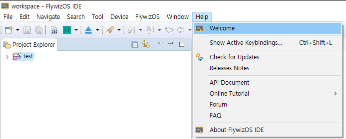

# FlywizOS IDE 처음 사용
[FlywizOS IDE](download.md)가 성공적으로 설치되면 개발자는 데스크탑 바탕화면에서   바로가기를 더블 클릭하여 IDE를 실행합니다.  
만약 바로가기를 삭제했다면, 설치된 폴더에서 bin폴더에서  를 찾아 직접 실행할 수 있습니다.

## Workspace 선택
 IDE를 실행하면, 아래의 팝업화면을 볼 수 있습니다.
* **Workspace** 는 개발에 관련된 설정과 이력이 저장되는 공간입니다. 이 공간은 여러 프로젝트를 동시에 관리하는 컨테이너처럼 이해할 수 있어, IDE를 동시에 여러개 실행할 필요가 없습니다.

   
## Welcome 화면
만약 처음으로 IDE를 실행하고 workspace를 선택하고나면 아래 그림의 Welcome화면을 볼 수 있습니다. 
이 화면은 2가지의 기능을 제공합니다 : **New Project** , **Import Project**

  * **New Project**  
    어떻게 [새로운 프로젝트를 생성](new_flythings_project.html)하는지를 단계적으로 수행합니다.
    
  * **Import Project**
    이 기능을 통해 기존에 만들어졌던 프로젝트들을 현재의 Workspace에 가져와서 이전 개발을 지속할 수 있습니다.
    [프로젝트 가져오기](import_project.md)
    
      
    

 Welcome화면을 다시 열기를 원한다면 **메뉴**에서 **Help -> Welcome** 를 선택하십시오.

   

​    
