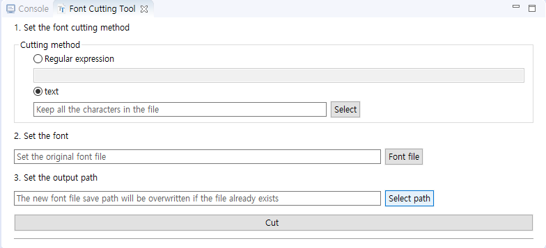
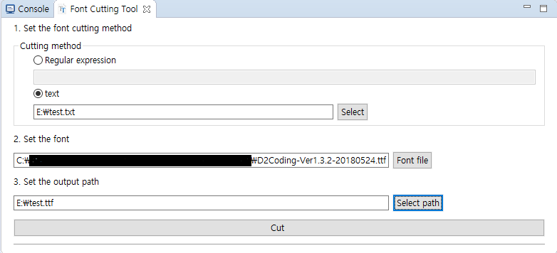

### Font cutting
대부분의 프로젝트에서는 커스텀 폰트를 사용할 것입니다. 그러나 어떤 폰트는 매우 큰 사이즈로 프로젝트에 적합하지 않을 수 있습니다. 또한 일반적으로 폰트의 특정 글자만을 사용하는 경우에는 필요한 폰트만을 잘라내어 사용하면 폰트가 차지하는 점유율을 줄여 전체적인 성능 향상에도 매우 도움을 줄 수 있습니다.

### Font cutting tool의 사용
상단 메뉴의 **Toos**에서 **Font cutting tool**을 찾을 수 있습니다.

1. 먼저 "Set the font cutting method"를 설정합니다. 여기서는 어떤 글자들을 사용할지 결정합니다.
   * Regular expression   
      java정규 표현식을 지원합니다. 예 : `\d`는 모든 숫자를 의미합니다.
   * Specify text  
     **UTF-8으로 인코딩된** 특정 txt파일 내의 컨텐츠만으로 폰트를 재 구성합니다.(권장하는 방법으로 간단하고 직관적입니다.)
   
2. Set the font  
   사용할 폰트를 설정합니다.
    
3. Set the output path  
   재 구성된 폰트가 저장될 경로를 설정합니다. 만약 기존에 만들었던 폰트 파일이 있다면, 새로운 파일로 교체됩니다.
    
4. 모든 설정이 끝난 후 **Cut**를 클릭합니다.

5. 만약 완료 메시지가 표시된다면 성공한 것이고, 새로운 폰트가 설정된 out path에 생성됩니다.

### 예제
새로운 txt파일을 만들어 오직 "Hello"라는 단어만 추가하고, **UTF-8**으로 저장하십시오. 그 후 **Font cutting tool**에 파라미터들을 설정하고, **Cut**버튼을 누르면 10KB이하의 ttf파일이 만들어지는 것을 확인할 수 있습니다. [Online Font Editor](http://fontstore.baidu.com/static/editor/index.html) 등으로 이 폰트는 오직 txt파일 안의 글자만을 포함하고 있는 것을 확인할 수 있습니다.

