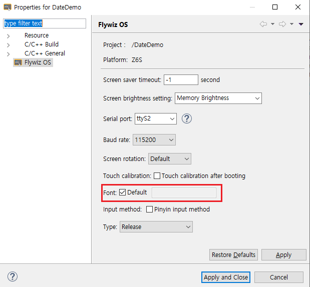
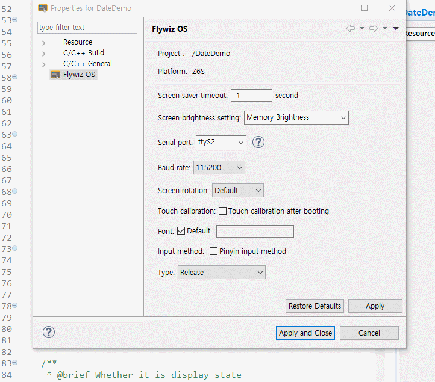

# Font setting
FlywizOS IDE의 기본 폰트는 **Consolas**입니다.

폰트의 옵션이 **Default**로 설정되어 있으면, 컴파일 및 업데이트 파일 생성 시 내장된 기본 폰트인 **fzcircle.ttf**가 포함됩니다.

> 만약 다른 폰트를 사용하고 싶다면, **Default** 체크 옵션을 해제하고 새로운 폰트를 설정하십시오. (**Note : ttf 포맷의 폰트만 지원 가능**) :

