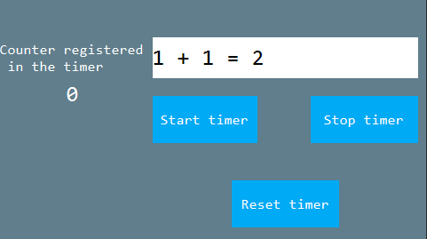

# 임의의 타이머 시작과 중지
타이머를 추가하는 방법으로 `REGISTER_ACTIVITY_TIMER_TAB`을 이용하는 방법이 있으나 이 방법은 타이머를 임의로 시작/중지 하기에 충분하지 않아 여기서는 타이머를 추가하는 다른 방법을 알아보겠습니다. 
Activity class에 제공되는 타이머를 컨트롤하는 세 가지 함수가 있는데, 아래는 각 함수들의 사용 예제입니다.

```c++
/**
 * Register timer
 */
void registerUserTimer(int id, int time);
/**
 * Un-register timer
 */
void unregisterUserTimer(int id);
/**
 * Reset timer
 */
void resetUserTimer(int id, int time);
```

1. logic.cc파일에 타이머가 설정되었는지 확인을 위한 변수를 선언합니다.
    ```c++
     /**
      * Whether the timer is registered
      */
     static bool isRegistered = false;
     #define TIMER_HANDLE   2

    ```
2. 그리고, 2개의 버튼을 만듭니다. 이 버튼들은 타이머를 설정하고 해제하는 기능을 수행합니다.
    ```c++
    static bool onButtonClick_ButtonTimerOn(ZKButton *pButton) {
        //Register the timer if not registered
        if (!isRegistered) {
            mActivityPtr->registerUserTimer(TIMER_HANDLE, 500);
            isRegistered = true;
        }
        return false;
    }

    static bool onButtonClick_ButtonTimerOff(ZKButton *pButton) {
        //If the timer is already registered, cancel the registration
        if (isRegistered) {
            mActivityPtr->unregisterUserTimer(TIMER_HANDLE);
            isRegistered = false;
        }
        return false;
    }
    ```
> [!Warning]
> 위의 3가지 함수 `registerUserTimer`, `unregisterUserTimer`, `resetUserTimer`를 `onUI_Timer` 함수에서 호출하지 마십시오. Deadlock의 원인이 됩니다.

## <span id = "example_download">예제 코드</span>
[예제 코드](demo_download.md#demo_download)의 TimerDemo 프로젝트를 참고하십시오.  

아래는 Timer Demo의 프리뷰입니다.  

     