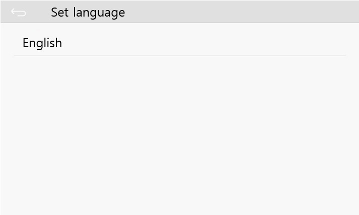

개발자가 직접 만든 액티비티 이외에, 시스템에서 제공되는 몇 가지 내장된 액티비티가 있습니다. 예를 들어 TF카드를 이용해 시스템을 업데이트 시 자동으로 실행되는 내장 액티비티가 있습니다.


이외에 설정 액티비티가 있고 아래의 방법으로 실행할 수 있습니다.
```c++
EASYUICONTEXT->openActivity("ZKSettingActivity");
```

또한 버튼 등을 이용해 설정 액티비티를 실행할 수도 있습니다. (다른 여러 내장 액티비티도 이러한 방법으로 실행이 가능합니다.)
```c++
static bool onButtonClick_Button1(ZKButton *pButton) {
    EASYUICONTEXT->openActivity("ZKSettingActivity");
    return false;
}
```


각각의 아이템이 선택되면, 각기 내장된 다른 액티비티가 실행됩니다. 먼저 **Network**을 선택합니다.
```c++
EASYUICONTEXT->openActivity("NetSettingActivity");
```


WIFI 설정:
```c++
EASYUICONTEXT->openActivity("WifiSettingActivity");
```


만약 사용중인 보드가 WIFI를 지원한다면, 오른쪽 상단의 WIFI on버튼을 활성 화 시 WIFI를 검생하여 액티비티에 표시합니다.

Hotspot 설정:
```c++
EASYUICONTEXT->openActivity("SoftApSettingActivity");
```


**Language** 설정:
```c++
EASYUICONTEXT->openActivity("LanguageSettingActivity");
```


Touch calibration 설정:
```c++
EASYUICONTEXT->openActivity("TouchCalibrationActivity");
```


Developer options 설정:
```c++
EASYUICONTEXT->openActivity("DeveloperSettingActivity");
```


현재는 오직 ADB 디버깅에 대한 설정이 가능합니다.
