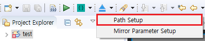

# Upgrade image 파일 만들기
앞선 챕터에서 우리는 [다운로드 및 디버그](adb_debug.md#下载调试) 메뉴를 통해 프로그램을 실행했습니다. 그러나 그것은 프로그램을 보드에 저장하는 것이 아니라서 보드의 전원을 해제했다 재 시작하면 다운로드 이전의 프로그램이 실행됩니다. 따라서 만약 보드에 프로그램을 저장하기 원한다면 먼저 프로그램을 업데이트 이미지 파일로 만들고 보드를 업데이트하십시오. 그러면 업데이트 후 재 시작 시 업데이트 된 프로그램이 실행됩니다.

## 사용법
먼저 업데이트 이미지 파일이 생성될 경로를 설정합니다.
1. 툴바에서 아래 이미지를 찾습니다.   
   

2. 드랍 다운 화살표 버튼을 클릭 후 팝업 메뉴의 **Path Setup**을 선택합니다.   
   

3. 팝업 박스에서 업데이트 이미지 파일을 저장할 경로를 선택 후 OK를 클릭합니다.
4. 위 과정에서 우리는 업데이트 이미지 파일의 생성 경로를 설정했습니다. 이제 아래 그림의 버튼을 누릅니다. 그러면 IDE는 컴파일을 수행하고, 해당 결과물을 패키지화하여 **update.img**파일을 설정된 경로에 생성합니다.  
   

5. **update.img**파일이 성공적으로 생성되면 TF카드(주의 : FAT32 형식의 TF 카드만 지원)의 root 디렉토리에 복사 후 보드에 삽입합니다. 그러면 시스템은 TF 카드의 파일을 감지하고 아래 그림처럼 업데이트 프로그램을 실행합니다. 그 후 체크박스를 터치해서 체크 한 후 업데이트 버튼을 누르면 업데이트가 시작됩니다. 업데이트가 완료된 후에는 바로 카드를 제거하여 다시 업데이트되는 것을 방지합니다.     
      

**보드의 터치가 손상되었거나 터치가 없는 보드의 경우 버튼을 클릭할 수 없어 업데이트가 불가능합니다. 이 이러한 경우에는 [자동 업데이트](autoupgrade.md)를 참고하여 업데이트 하십시오.**