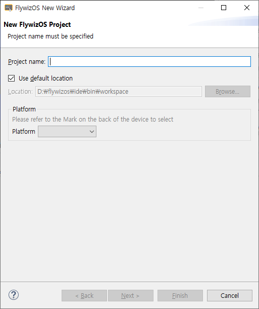
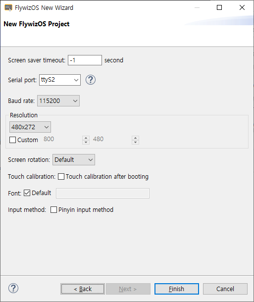

# 새로운 FlywizOS 프로젝트 생성
 새로운 FlywizOS 프로젝트를 만드는 것은 매우 간단합니다. 구체적인 단계는 다음과 같습니다 :
1. IDE의 상단 메뉴바에서 **File -> New -> FlywziOS Application Project**를 선택합니다.

     

2. 앞서 선택이 완료되면 **FlywizOS New Wizard**가 팝업됩니다.
  
     
   새로운 프로젝트를 만드는데 필요한 파라미터들을 채우십시오.

   * **Project name**  
    프로젝트의 이름입니다. 숫자와 문자의 조합으로 만들 수 있습니다.
   * **Location**  
    프로젝트가 저장될 경로입니다.
   * **Platform**  
    소유한 보드에 맞는 플랫폼을 선택하십시오.
     - **Z11S**  
     - **Z6S**  
   
   위의 파라미터들을 채운 후, 바로 **Finish**를 누르면 프로젝트가 생성됩니다. 그러나 지금은 더 많은 설정을 위해 **Next**를 선택하겠습니다.
3. Next 클릭 후, 아래와 같은 파라미터들을 볼 수 있습니다.
  
     
   
   
   ## 프로젝트의 각 속성의 의미와 기능
   * **Screen saver timeout**  
   
    FlywizOS 시스템은 스크린 세이버 기능을 제공합니다. 만약 특정 시간 내에 터치 조작이 없거나, 코드를 통해 스크린 세이버 시간을 리셋하지 않는다면 시스템은 자동으로 스크린 세이버로 진입합니다.
    시간이 **-1**이면 스크린세이버 기능을 사용하지 않겠다는 의미입니다.
   
   * **Serial port**  
    통신용 시리얼 포트이며 일반적으로 수정할 필요가 없습니다.
   
   * **Baud rate**   
    통신용 시리얼 포트의 Baud rate입니다.
   
   * **Resolution**  

      스크린의 width와 height입니다. 단위는 픽셀입니다.

   * **Screen rotation**  
    일부 화면 좌표 축 방향의 경우 이 옵션을 선택하여 표시된 컨텐츠를 90°회전하여 정상적으로 표시할 수 있습니다.
   
   * **Font**  
    FlywizOS는 custom font를 지원합니다. 만약 기본 폰트가 만족스럽지 않다면, **Default**를 해제하고 사용할 폰트를 선택할 수 있습니다.
   
   * **Input method**  
    만약 중국어 입력이 필요하다면 선택하십시오. 그리고 **[Edit Text](edittext.md)** 컨트롤의 중국어 입력을 해결하십시오.

   위 속성들은 이후 다시 수정이 가능하니 이곳을 채우는 것을 걱정하지 마십시오.([프로젝트의 속성을 수정하는 방법](set_project_properties.md))  
   모든 채워진 모든 속성을 확인하고, **Finish**를 누르면 프로젝트 생성이 끝납니다. 생성 프로세스에는 약간의 시간이 걸리므로 잠시 기다려주십시오.

4. 프로젝트가 생성되면 먼저 [FlywizOS 프로젝트 코드 구조 소개](project_structure#project_structure.md)를 이해해야합니다.

