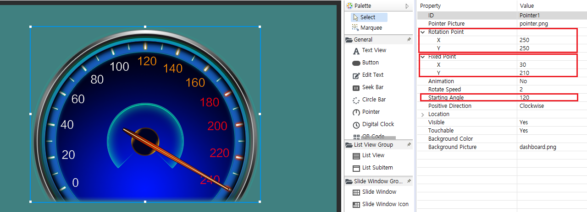
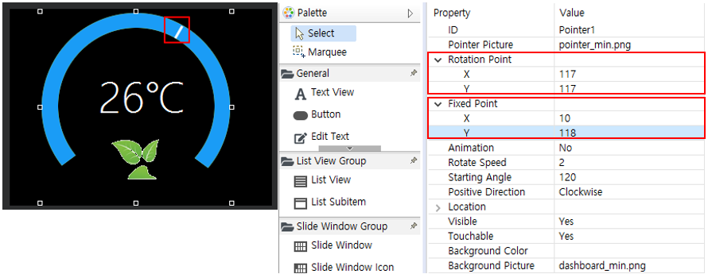

# Pointer control
## 특징
미터기 또는 시계의 회전과 유사한 효과를 얻으려면 이 컨트롤로 쉽게 구현 할 수 있습니다. 이 컨트롤은 그래픽 회전을 처리하도록 특별히 설계되었습니다.

## 아이디어
미터기는 다이얼로 사용하는 정적 배경 이미지와 배경 이미지에서 회전하는 포인터 이미지의 두 부분으로 나눌 수 있습니다. 따라서 배경 이미지와 포인터 이미지를 선택한 후 포인터 회전의 중심 좌표만 결정하면 됩니다.

## 사용법
1. 먼저 **Pointer**컨트롤을 만들면, 아래 속성들을 확인할 수 있습니다.
   
     
   
   여전히 컨트롤 생성 방법을 모르는 경우 [버튼 컨트롤 생성 방법](button.md#add_button)을 참조하세요.
   속성 창에서 **Pointer Picture**와 **Background Picture**를 추가 한 것을 볼 수 있습니다.
   추가 프로세스는 애니메이션에 표시됩니다. 

   

2. 위의 마지막 미리보기 이미지로 판단하면 문제가 발견되지 않았으며, 배경 이미지와 포인터 위치가 정상적인 것처럼 보입니다. 그러나 프로그램이 실제로 실행된 후에는 포인터가 잘못된 것을 확인할 수 있습니다. 이를 수정하기 위해 **Starting Angle**속성을 120으로 조정합니다. 그러나 포인터가 120°회전한 후에도 결과가 예상과 다르다는 것을 알 수 있습니다.
   
     
   그 이유는 포인터가 회전하는 원의 중심 좌표가 올바르지 않기 때문입니다.
   포인터 회전 중심의 좌표를 결정하는 두 가지 속성은 **Rotation point**와 **Fixed point**입니다.

   * Rotation point   
   좌표는 컨트롤의 전체 사각형 영역을 참조합니다. 컨트롤의 사각형 영역의 왼쪽 위 모서리는 [0,0] (픽셀 단위)입니다. 이러한 미터기의 경우 원하는 회전 점의 좌표는 분명히 다이얼의 중앙에 있습니다. 그러면 해당 그림의 특정 좌표는 아래와 같이 (250, 250)입니다.  
     
   * Fixed point  
   좌표는 포인터 그림을 참조하고 그림의 왼쪽 위 모서리는 [0,0]으로 단위는 픽셀입니다. 사용된 포인터 그림의 경우 원하는 포인터의 고정 점 좌표는 (30, 210)입니다.  
     

   두 좌표를 속성 창에 입력하면 포인터가 올바른 위치로 회전하는 것을 볼 수 있습니다.  

   

    **Starting angle**은 음수를 지원합니다. 위의 예에서 **Starting angle**을 -120으로 변경하면 포인터가 다이얼 0 위치를 가리 킵니다.

## 포인터 Fixed Point에 대한 팁 
위의 예에서 포인터의 Fixed Point 좌표는 포인터 그림에 위치하며 실제로이 좌표는 커서 효과를 얻기 위해 그림의 범위를 초과 할 수도 있습니다. 아래 그림과 같이 빨간색 상자의 흰색은 실제로 포인터 그림으로 상대적으로 작지만 오른쪽 속성에서는 그림의 실제 크기를 훨씬 넘는 포인터 고정 점 좌표를 설정 한 다음 회전 좌표를 조정하여 원형 커서의 효과을 얻습니다.



## 조작 함수 
이러한 유형의 컨트롤의 조작을 위한 가장 일반적인 방법은 코드를 통해 포인터의 회전 각도를 조정하는 것입니다.
```c++
//Adjust the pointer to 90 degrees
mPointer1Ptr->setTargetAngle(90.0);
```

# Sample code
[Sample Code](demo_download.md#demo_download)의 PointerDemo 프로젝트를 참고하십시오.