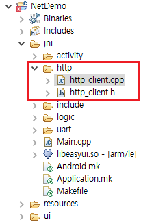

# 원격 업그레이드
현재 시스템에는 원격 업그레이드를 위한 액티비티가 없습니다.  
그러나 우리는 TF카드 감지 및 업그레이드 메커니즘을 이해하면 이를 응용하여 원격 업그레이드 구현을 위한 자체 코드를 추가 할 수 있습니다.  
이를 위해 먼저 TF 카드를 삽입하는 일반적인 업그레이드 프로세스를 소개합니다.

## TF 카드 감지 업그레이드 프로세스
시스템을 시작하거나 TF카드를 삽입 할 때 [TF 카드가 정상적으로 장착되어있는 경우](tf.md) 시스템은 **TF 카드의 루트 디렉토리**에 **update.img**파일이 있는지 확인합니다.(TF카드의 루트 디렉토리는`/mnt/extsd`에 매핑됩니다) 이후 파일이 있는 경우 파일이 요구 사항을 충족하는지 추가로 확인하여 통과하면 업그레이드 액티비티가 나타나고 사용자가 업그레이드를 선택할 수 있습니다. 파일이 존재하지 않는 경우 프로세스가 종료되고 액티비티에는 어떤 행동도 일어나지 않습니다.

## 구현 단계
1. 먼저 업그레이드 이미지 `update.img`를 다운로드해야 합니다. 정상적인 상황에서는 HTTP 프로토콜을 통해 파일을 다운로드하는 것이 가장 쉬운 방법이며 실제 상황에 따라 다른 프로토콜을 선택할 수도 있습니다.  
   다운로드 후 이미지 파일을 TF 카드 디렉토리`/mnt/extsd/`에 저장합니다.
   > [!Note]
   > 보드에 TF카드가 삽입되어 있지 않은 경우에도 이 디렉토리는 메모리에 매핑되기 때문에 파일 저장이 가능합니다. 그러나 메모리 크기에 의해 제한되며 이미지 파일이 너무 크면 비정상 동작 또는 업그레이드 실패의 원인이 될 수 있습니다.  
   TF카드를 삽입 한 경우 메모리 크기 문제를 무시할 수 있습니다.

2. 업그레이드 모니터링 함수 호출  
   먼저 [UpgradeMonitor.h](https://developer.flywizos.com/src/UpgradeMonitor.h) 소스 파일을 다운로드하여 프로젝트의`jni/include/os`디렉토리에 저장합니다.

   

   그런 다음 아래 함수를 호출하여 업그레이드를 모니터링 하십시오.
   ```c++
   #include "os/UpgradeMonitor.h"
   ```
   ```c++
   //Actively detect whether there is a correct update.img file in the /mnt/extsd directory,
   //If yes, an upgrade prompt box will pop up
   //If not, nothing happens
   UpgradeMonitor::getInstance()->checkUpgradeFile("/mnt/extsd");
   ```
업그레이드 액티비티가 나타나면 사용자가 업그레이드 여부를 선택할 수 있습니다.  
지금까지 원격 업그레이드 기능이 완전히 구현되었습니다.
   
## 파일 다운로드 후 자동 업데이트
업그레이드 파일을 다운로드 한 후 강제로 업데이트하려면 [자동 업데이트](autoupgrade.md) 문서를 참조하여 코드로 `zkautoupgrade`파일을 생성하기만 하면 됩니다.

## 반복적인 업그레이드 방지
위 단계에서 이미지 파일을 `/mnt/extsd/`디렉토리에 저장합니다. 성공적으로 업그레이드하면 보드가 자동으로 다시 시작됩니다. 이때 시스템은 정기적인 업그레이드 모니터링 프로세스를 수행하며 이미지 파일이 존재하기 때문에 업그레이드 액티비티가 다시 팝업되어 업그레이드가 반복됩니다.

### 해결책
이미지 파일을 다운로드 할 때 `/mnt/extsd/`가 아닌 다른 디렉토리에 저장하십시오. 예 :`/mnt/extsd/temp/`  
또한 모니터링 함수 호출 시 파라미터도 수정합니다.

```c++
UpgradeMonitor::getInstance()->checkUpgradeFile("/mnt/extsd/temp");
```

## Sample
[Complete sample download](https://docs.flythings.cn/src/netupdate.zip)  
샘플은 단순히 http클라이언트를 구현하여 파일을 다운로드합니다. 소스 코드의 http 부분을 참조하십시오.
파일 다운로드는 시간이 많이 걸리는 작업이므로 인터페이스의 즉각적인 응답에 영향을 주지 않도록 파일을 별도의 스레드에 배치하는 것이 좋습니다.

  
* 키 코드
  ```c++ 
  class DownloadThread : public Thread {
      protected:
      virtual bool threadLoop(){
          http::HttpClient http;
          mTextview1Ptr->setText("Download the upgrade file");
          //Create a save path for the upgrade file
          system("mkdir /mnt/extsd/temp");
          //Modify here to the real service IP
          string err = http.Download("192.168.1.1/update.img", 80, "/mnt/extsd/temp/update.img");
          mTextview1Ptr->setText(err);
          if (err.empty()) {
              UpgradeMonitor::getInstance()->checkUpgradeFile("/mnt/extsd/temp");
          }
          mButton1Ptr->setInvalid(false);
          return false;
      };
  };
  ```

* 서버 구현  
  테스트의 편의를 위해 예제에는 실행파일 `http.exe`가 포함되어 있습니다.
  
    
  
  업그레이드 이미지 파일 `update.img`와 `http.exe`를 같은 폴더에 넣은 다음 `http.exe`를 더블 클릭하여 실행합니다. 네트워크가 정상이면 웹 사이트 미러 파일를 통해 같은 디렉토리에 있는 파일을 다운로드 할 수 있습니다.
  
  예 :  
  http://192.168.1.1/update.img    
  (IP 주소를 컴퓨터의 현재 IP로 수정하십시오.)  

  서버가 시작된 후 샘플 코드를 실행하여 원격 업그레이드를 테스트하십시오.
