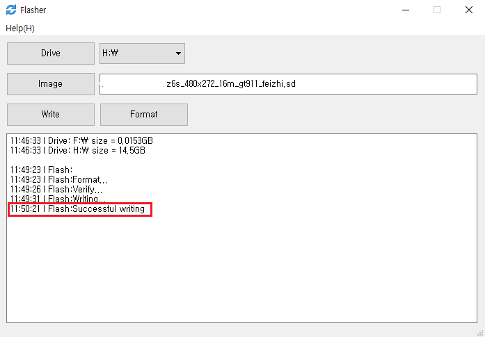

​      
##  플래쉬 카드 만들기
>[!Warning]
>**참고 : TF 카드의 최대 용량은 16G를 지원합니다. 그 이상의 TF카드를 인식 할 수 없으며 업그레이드 할 수 없습니다.
>최신 소프트웨어 업데이트 패키지는 QQ[371608200](// shang.qq.com/wpa/qunwpa?idkey=da6e12d1773a7e55295a0accd2a46ad51aece61657fe55a2f8277f4cd91dc56a)에서 다운로드 하십시오. 다운로드 시 보드에 해당하는 소프트웨어 버전(보드의 후면 [Tag](board_tag_explain.md)를 확인)을 확인 하십시오. 만약 다른 버전이 사용되면 업그레이드 후 정상동작 하지 않을 수 있습니다!**

1. [Computer Flash Tool](http://download.zkswe.com/tool/Flasher.zip) 다운로드 합니다.    

2. 컴퓨터에서 TF 카드 드라이브를 선택하십시오.    
       
    
3. 업그레이드 이미지 파일을 선택하십시오.    
       

4. 제작을 위해 클릭    
       
       
       
    
5. 프로그래밍이 성공하면 TF 카드를 꺼내고 보드에 삽입 한 다음 다시 전원을 켜서 업그레이드하십시오.

## TF카드 복구
1. 컴퓨터에서 TF 카드 드라이브를 선택하십시오.    
     
    
2. 카드 복구를 클릭합니다.    
       
       
       

3. 포맷 후 카드는 정상적으로 사용 가능합니다.

