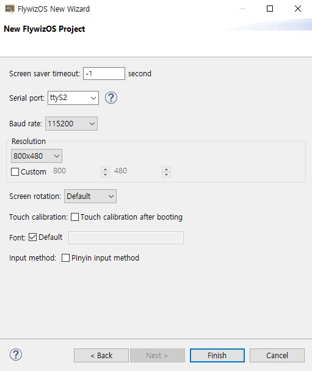
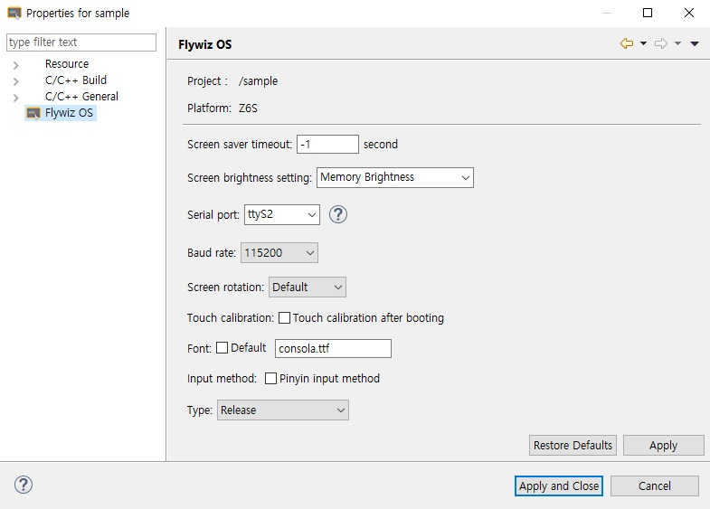

# 시리얼 포트를 구성하는 방법
## 시리얼 포트 번호 선택

소프트웨어와 하드웨어의 설계 호환성으로 인해 소프트웨어의 일련 번호가 하드웨어의 일련 번호 식별과 다를 수 있습니다. 구체적인 관계는 다음과 같습니다.

* FW-11s Series platform

| Software serial port number | Hardware serial port number |
|:--------:|:-------:|
| ttyS0   | UART1  |
| ttyS1   | UART2  |

* FW-6 Series platform

| Software serial port number | Hardware serial port number |
|:--------:|:-------:|
| ttyS0   | UART0  |
| ttyS1   | UART1  |
| ttyS2   | UART2  |

## 시리얼 포트 Baud rate 구성
1. 새 프로젝트를 만들 때 Baud rate를 구성합니다.

  

2. 프로젝트 속성에서 Baud rate 구성
    프로젝트를 마우스 오른쪽 버튼으로 클릭하고 팝업 메뉴에서 Property를 선택하면 다음 속성 상자가 나타납니다.

  

## 시리얼 포트 열기 및 닫기
jni/Main.cpp를 엽니다. 프로그램이 초기화되고 종료될 때 시리얼 포트가 열리고 닫히는 것을 볼 수 있습니다.

```c++
void onEasyUIInit(EasyUIContext *pContext) {
    LOGD("onInit\n");
    // open serial port
    UARTCONTEXT->openUart(CONFIGMANAGER->getUartName().c_str(), CONFIGMANAGER->getUartBaudRate());
}

void onEasyUIDeinit(EasyUIContext *pContext) {
    LOGD("onDestroy\n");
    // close serial port
    UARTCONTEXT->closeUart();
}
```