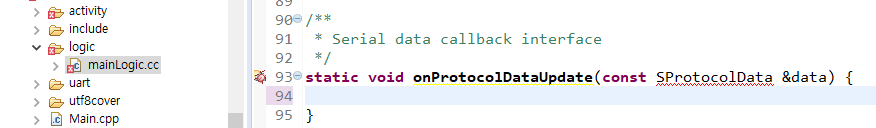

# 시리얼 포트 소개
아래 그림은 가장 간단한 통신 모델입니다. LCD와 MCU는 시리얼 포트를 통해 통신하며 정해진 프로토콜로 서로 상호 작용할 수 있습니다.

여기서 주목할 점이 있는데, 기존의 시리얼 포트 LCD는 슬레이브 장치로 사용되고 MCU를 통해 해당 명령을 전송하여 제어합니다. 그러나 FlywizOS의 시리얼 포트 LCD는 호스트처럼 자체적으로 운영이 가능하며 상호 작용할 수 있습니다.

통신과 관련된 코드를 처음부터 개발하려면 많은 시간이 소요될 수 있습니다. 개발 프로세스를 단순화하고 개발자가 비즈니스 로직 개발에 더 많은 주의를 기울일 수 있도록 FlywizOS IDE는 새 프로젝트를 빌드 할 때 자동으로 시리얼 통신 코드를 생성합니다. 

동시에 프로토콜 데이터 및 액티비티의 상호 작용을 위한 콜백 인터페이스도 제공합니다.

개발자가 UI액티비티의 데이터 표시에 더 많은 관심을 기울일 수 있도록 통신 부분은 프레임 워크에 의해 자동으로 완료됩니다.
통신 프레임 워크의 프로토콜 분석 부분은 개발자가 사용하는 통신 프로토콜에 따라 변경되어야 하며, 다음 장의 [통신 프레임 워크 설명](serial_framework.md)에서는 원리와 수정이 필요한 부분에 대해 집중적으로 살펴 보겠습니다. 그리고 [시리얼 통신 예제](serial_example.md)의 장에서는 몇 가지 사례를 통해 통신 프레임 워크에 대한 이해를 심화합니다.