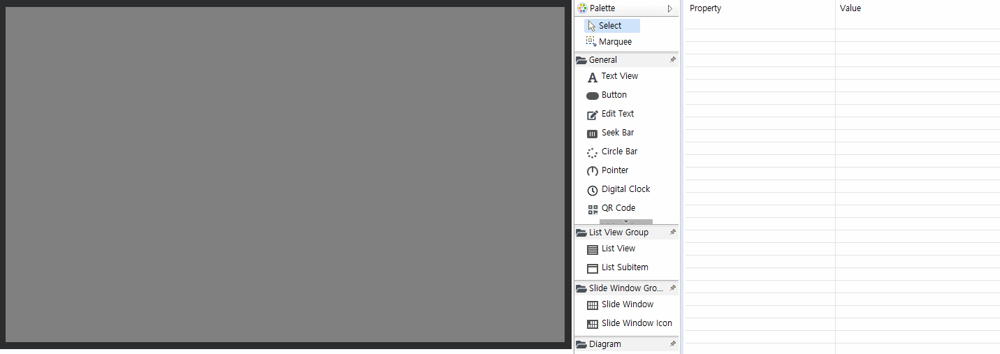
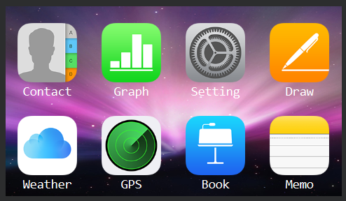

# Slide Window 컨트롤
 Slide Window 컨트롤은 휴대폰의 메인 인터페이스에서 좌우로 슬라이딩하는 인터페이스 효과와 유사합니다. 슬라이딩 기본 창과 여러 아이콘으로 구성됩니다.


## 사용법
1. 먼저 UI 파일에 **Slide Window** 컨트롤을 만든 다음 **Slide Window icon** 컨트롤을 몇 개 추가합니다.

   

2. **Slide Window icon** 컨트롤을 추가하면 아이콘이 순서대로 자동 정렬됩니다. 만약 한 페이지에 추가가 완료된 후에도 계속 추가하면 페이지가 자동으로 넘어갑니다. 추가 된 모든 아이콘 컨트롤은 **Outline**에서 찾을 수 있습니다. 

      

    **Slide Window Icon**의 위치를 조정하려면 Outline에서 노드를 선택한 다음 드래그하여 직접 조정할 수 있습니다. 아래 애니메이션의 왼쪽 하단에 있는 Outline의 작동에 유의하십시오.

    

3. **Outline**에서 **Slide Window Icon** 컨트롤을 선택하면 그림을 추가하고 텍스트를 개별적으로 수정할 수 있습니다. **Slide Window**을 선택하여 행과 열 수를 조정하고 **글꼴 크기, 아이콘 크기**를 균일하게 조정할 수도 있습니다.

      


## 코드 조작  

1. Slide Window 컨트롤을 추가하면 컴파일 후 자동으로 상관 함수가 생성되며, 자세한 기능 설명은 [슬라이드 윈도우 상관 함수](relation_function.md # slidewindow)를 참조하십시오.

2. 일반적인 상황에서는 터치하고 슬라이드하여 위아래로 스크롤하기 만하면됩니다. 그러나 페이지 넘김 기능도 제공합니다.
  * 다음 페이지로 전환
    ```c++
    // Switch to the next page with animation
    mSlideWindow1Ptr->turnToNextPage(true);
    // Switch to the next page without animation
    mSlideWindow1Ptr->turnToNextPage(false);
    ```
  * 이전 페이지로 전환
    ```c++
    // Switch to the previous page with animation
    mSlideWindow1Ptr->turnToPrevPage(true);
    // Switch to the previous page without animation
    mSlideWindow1Ptr->turnToPrevPage(false);
    ```
3. Slide Window가 코드를 통해 어떤 페이지로 전환되었는지 모니터링 할 수도 있습니다. 
    ```c++
    namespace { // Add an anonymous scope to prevent multiple source files from defining the same class name and conflict at
        		// runtime
    // Implement your own listening interface
    class MySlidePageChangeListener : public ZKSlideWindow::ISlidePageChangeListener {
    public:
        virtual void onSlidePageChange(ZKSlideWindow *pSlideWindow, int page) {
            LOGD("Now switch to page %d", page);
        }
    };
    }
    // Define the listening object
static MySlidePageChangeListener sMySlidePageChangeListener;
    
    static void onUI_init() {
        mSlidewindow1Ptr->setSlidePageChangeListener(&sMySlidePageChangeListener);
    }
    ```
    
4. 현재 페이지 가져오기
    ```c++
    int i = mSlideWindow1Ptr->getCurrentPage();
    LOGD("Current page %d", i);
    ```


# Sample code

   

더 자세한 내용은 [Sample Code](demo_download.md#demo_download)의 SlideWindowDemo 프로젝트를 참고하십시오.

