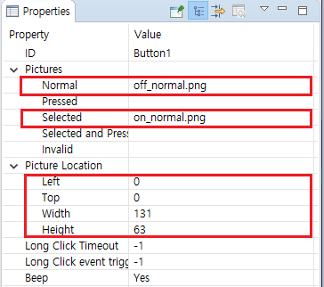

# Button
## <span id = "add_button">버튼 추가 및 속성 변경</span>

1. 프로젝트 창에서 버튼을 추가하고자 하는 액티비티의 UI을 더블 클릭합니다.
2. 우측의 컨트롤 박스에서 `Button` 컨트롤을 선택합니다.
3. `Button`컨트롤을 왼쪽 클릭 후 원하는 위치에 클릭하거나 드래그 앤 드롭하면 컨트롤이 만들어집니다.
4. 만들어진 버튼을 왼쪽 클릭하면 속성 창에서 해당 버튼과 관련된 속성들을 확인하고, 변경할 수 있습니다.

   


## 버튼 색 변경

 ["텍스트 및 색상 변경"](textview.md#change_color)을 참고하십시오.


## <span id = "add_button_style">버튼에 에니메이션 효과 추가</span>

["버튼 상태에 따른 이미지 추가"](#add_multi_state_photo_for_button)을 참고하십시오.


## <span id = "add_multi_state_photo_for_button">버튼 상태에 따른 이미지 추가</span>

 기본 버튼 컨트롤의 색은 단색이지만, 사용자가 원하는 이미지 등을 추가할 수 있습으며, 아래는 그 방법입니다.

 1. 먼저 UI파일에 버튼을 추가합니다..
 2. 추가된 버튼을 왼쪽 클릭하여 속성 창을 불러옵니다.
속성에서 이미지와 관련한 속성은 아래와 같습니다.
  * Picture settings
      - 이 속성은 버튼의 각 상태에 따른 이미지를 설정할 수 있고, 버튼의 상태가 바뀌면 자동으로 해당 이미지로 변경됩니다.
  * Picture location
     - 기본적으로 버튼에 설정된 이미지는 버튼의 중앙을 기준으로 확대/축소되어 버튼과 같은 크기로 변경되는데, 이 속성은 이미지를 버튼의 특정 위치에 특정 크기로 위치시킬 수 있습니다.
  * Background picture
     - 버튼의 배경 이미지를 설정합니다. 이미지는 자동으로 버튼의 크기만큼 확대/축소되어 표시됩니다.

예제：   



  결과 이미지 :  


 위의 스크린샷은 속성 창의 파라미터 값을 보여주며, 그것의 의미는 다음과 같습니다.
 버튼은 기본적으로 "off_normal.png"를 표시하고, 선택되었을 때 "on_normal.png"로 변경됩니다.  
 left, top, width, height는 이미지의 표시 위치(픽셀 단위)를 결정합니다. 사각형의 왼쪽 위 모서리가 시작 점(0, 0)이고, 오른쪽 / 아래쪽 방향으로 값이 증가하고, (131, 63)이 종료 점입니다. 만약 이미지의 실제 width와 height가 속성 창의 파라미터 값과 다르다면 이미지는 해당 속성 값에 따라 확대/축소됩니다.

  

### 버튼 컨트롤 간의 계층 관계
일반적으로 버튼 컨트롤은 4단계의 과정을 거쳐 디스플레이 됩니다.
* 버튼의 텍스트

* 버튼의 이미지

* 버튼의 배경 이미지

* 버튼의 배경 색

  

## 버튼에 이미지 추가
["버튼 상태에 따른 이미지 추가"](#add_multi_state_photo_for_button)참고

## 버튼이 눌렸을 때, 어디에, 어떻게 코드를 추가하나요?
 실제 개발에서 버튼은 매우 자주 사용되는 컨트롤 중 하나입니다. 보통 버튼 클릭 이벤트 발생 후 UI의 화면의 내용이 갱신되는 등의 과정이 수행됩니다. 이를 위해 버튼이 클릭되었을 때 응답을 처리하는 과정이 필요하며, 아래는 이에 대한 과정입니다.

1. 먼저 ID가 `Button1`인 버튼을 만듭니다.

   
2. 프로젝트 탐색기에서 현재 프로젝트를 선택하고 마우스 오른쪽 클릭하여 보여지는 팝업 메뉴중  `Compile FlyThings`를 선택합니다. 이 기능은 UI파일을 기반하여 자동으로 템플릿코드를 생성합니다.([코드 생성에 대한 자세한 이해](ftu_and_source_relationships.md#ftu_and_source_relationships))
3. UI 파일 `main.ftu`을 예로 들면, 이전 과정이 끝난 후 `jni/logic/mainLogic.cc` 파일이 현재 프로젝트 폴더에 아래와 같이 생성됩니다.

    <br/>
    Note : `main.ftu` 로 자동 생성된 `mainLogic.cc`, 두 파일의 prefixes는 동일합니다.([코드 생성에 대한 자세한 이해](ftu_and_source_relationships.md#ftu_and_source_relationships))
4. `mainLogic.cc`을 더블 클릭하여 열면,  파일에 아래의  코드가 있는 것을 확인할 수 있습니다.
```c++
static bool onButtonClick_Button1(ZKButton *pButton) {
	//LOGD(" ButtonClick Button1 !!!\n");
	return false;
}
```
 스크린에서 생성된 버튼을 클릭하면 자동으로 위 함수가 호출됩니다. 그러므로 이 함수에 코드를 추가하는 것으로 사용자는 자신만의 프로세스를 추가할 수 있습니다.

 *  함수의 이름은 특정한 규칙에 의거하여 생성되는 것을 확인할 수 있고, 위의 예제에서처럼 생성된 함수의 이름은 `onButtonClick_XXXX(ZKButton *pButton)`로 여기서 XXXX는 해당 컨트롤의 ID로 대체됩니다.

[컨트롤과 함수의 관계에 대한 이해](relation_function.md#relation_function)


## 시스템 버튼
 사용자가 정한 ID이외에 버튼 컨트롤은 2개의 시스템 버튼 ID를 가지고 있는데, `sys_back`과 `sys_home`이 바로 그것입니다. 이름으로부터 대략적으로 그 기능을 알 수 있듯이 **뒤로** 와 **홈** 기능을 위한 ID입니다. `sys_back`버튼을 클릭하면 직전 액티비티로 돌아가고,  `sys_home`을 클릭하면 "**mainActivity**"로 바로 돌아가며, 특별한 추가 구현 없이 ID의 값만 해당 시스템 아이디로 설정하는 것으로 기능이 지원됩니다.


[액티비티간의 상호 작용에 대한 이해](open_close_app#close_app.md)

## Long key 이벤트 처리
만약 long key 이베트를 처리할 필요가 있다면 직접 해당 이벤트 리스너를 추가해야 합니다. 아래는 그 과정입니다.
1. 버튼 컨트롤의 속성 창에서 **Long Click Timeout**과 **Long Click event trigger interval time**을 다음 그림과 같이 설정합니다.(단위 : 밀리세컨드)

   

2. 속성 설정 후 컴파일을 하고 해당 파일의 Logic.cc파일을 열고, 파일의 시작 부분에 `ZKBase::ILongClickListener` 클래스를 상속받는 `class LongClickListener`와 `virtual void onLongClick(ZKBase *pBase)` 함수를 구현합니다.

    ```c++
    namespace { 
    // Add an anonymous scope to prevent multiple source files from defining the same class name and conflict at runtime	
    
    //Realize the long press monitoring interface
class LongClickListener : public ZKBase::ILongClickListener {
    
             virtual void onLongClick(ZKBase *pBase) {  
                    LOGD("Trigger long press event");
                static int count = 0;
    
                    char buf[128] = {0};
                    snprintf(buf, sizeof(buf), "Long press event trigger times %d", ++count);
                    //Each time a long press event is triggered, modify the text of the button
                    mLongButtonPtr->setText(buf);
             }
};
    
    }
    ```
    
3. `class LongClickListener`의 오브젝트 생성

    ```c++
    static LongClickListener longButtonClickListener;
    ```

4. `static void onUI_init()`함수에서 long click 모니터링 인터페이스를 등록하는 함수를 추가

    ```c++
    static void onUI_init(){

            //Register the button long press monitoring interface
            mLongButtonPtr->setLongClickListener(&longButtonClickListener);
    }
    ```
    
5. `static void onUI_quit()` 함수에 long click 모니터링 인터페이스를 등록 취소하는 함수를 추가

    ```c++
    static void onUI_quit() {
           //Un-register the button long press monitoring interface
           mLongButtonPtr->setLongClickListener(NULL);
    }
    ```
    
6. 코드 추가 후 컴파일, 다운로드하여 보드에서 테스트하십시오. 만약 버튼의 텍스트가 변경되었다면 `onLongClick`함수가 성공적으로 동작하였음을 의미합니다.
    자세한 구현은 [예제 코드](demo_download.md#demo_download)를 참고하십시오.

  

## 버튼 터치 이벤트 처리
만약 버튼 컨트롤에 **press** 또는 **lift** 이벤트에 대한 응답이 필요하다면 터치 모니터링 인터페이스를 등록하여 할 수 있습니다. 아래는 예제 코드입니다.

1. 사용자만의 터치 모니터링 인터페이스 구현
    ```c++
    namespace {	
    // Add an anonymous scope to prevent multiple source files from defining the same class name and conflict at runtime
    
    // Implement touch monitoring interface
    class TouchListener : public ZKBase::ITouchListener {
    public:
        virtual void onTouchEvent(ZKBase *pBase, const MotionEvent &ev) {
            switch (ev.mActionStatus) {
            case MotionEvent::E_ACTION_DOWN:
                mTouchButtonPtr->setText("Press");
                break;
            case MotionEvent::E_ACTION_UP:
                mTouchButtonPtr->setText("Lift");
                break;
            default:
                break;
            }
        }
};
    
    }
    ```
    
2. 리스너 오브젝트 생성

    ```c++
    static TouchListener sTouchListener;
    ```

4. `static void onUI_init()` 함수에 터치 모니터링 인터페이스 등록 코드 추가 

    ```c++
    static void onUI_init() {
        //Register the button touch monitoring interface
        mTouchButtonPtr->setTouchListener(&sTouchListener);
    }
    ```
    
5. `static void onUI_quit()` 함수에 터치 모니터링 인터페이스 등록 해제 코드 추가

    ```c++
    static void onUI_quit() {
        //Un-register the button touch monitoring interface
        mTouchButtonPtr->setTouchListener(NULL);
    }
    ```
    
6. 코드 추가 후 컴파일, 다운로드하여 보드에서 테스트하십시오. 
자세한 구현은 [예제 코드](demo_download.md#demo_download)를 참고하십시오

## 예제 코드 

[예제 코드](demo_download.md#demo_download) 의 ButtonDemo 프로젝트를 참고하십시오

프리뷰 화면 :


