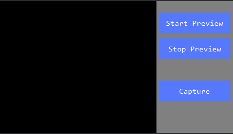

# 카메라
 FlywizOS는 카메라 컨트롤 기능을 제공합니다.

> [!Note]
>  모든 버전의 보드에서 카메라 기능을 지원하지는 않습니다. 만약 이 기능이 필요하다면 USB카메라 기능을 지원하는 보드를 구매해야 합니다.

## 사용법
1. 먼저 카메라 컨트롤을 만듭니다. 기본 배경은 검은색입니다.
2. 카메라 컨트롤의 속성창을 확인합니다.

     

  Auto Preview속성을 **On**으로 설정합니다.  
  연결되는 카메라 타입에 따라 **CVBS Signal** 속성을 선택합니다.

3. 카메라을 보드에 연결하고 프로그램을 다운로드하면 카메라로부터 입력되는 영상을 볼 수 있습니다.

   

## 프리뷰 시작/정지 
소스 코드를 통해 프리뷰의 시작/정지를 제어할 수 있습니다.
* 프리뷰 시작
```c++
mCameraView1Ptr->startPreview();
```
* 프리뷰 정지
```c++
mCameraView1Ptr->stopPreview();
```

## 프리뷰 화면 캡쳐

1. 카메라 콜백 인터페이스 구현
  ```c++
  class PictureCallback : public ZKCamera::IPictureCallback {
  public:
      virtual void onPictureTakenStarted() {
        mTextView1Ptr->setText("Start taking a photo");
      }
      virtual void onPictureTakenEnd() {
        mTextView1Ptr->setText("End of photo");
      }
      virtual void onPictureTakenError() {
        mTextView1Ptr->setText("Photo error");
      }
      virtual const char* onPictureSavePath() {
          //Photo save path
          return "/mnt/extsd/camera.jpg";
      }
  };
  ```

2. 카메라 콜백 인터페이스 선언
  ```c++
  //Defined as a global static variable
  static PictureCallback picture_callback;
  ```

3. 카메라 컨트롤에 터페이스 등록 및 등록 해제
  ```c++
  static void onUI_init(){
      mCameraView1Ptr->setPictureCallback(&picture_callback);
  }
  ```
  ```c++
  static void onUI_quit() {
    //Remember to empty the registration interface when the interface exits
      mCameraView1Ptr->setPictureCallback(NULL);
  }
  ```
4. 버튼 추가하여 버튼이 눌릴 시 화면 캡쳐
  ```c++
  static bool onButtonClick_Button3(ZKButton *pButton) {
	  //Request a photo
	  mCameraView1Ptr->takePicture();
      return false;
  }
  ```

## 예제 코드
이 예제에는 카메라 프리뷰, 앨범 기능등이 구현되어 있습니다.

[Sample code](demo_download.md#demo_download)의 CameraDemo 프로젝트 참고하십시오.

 