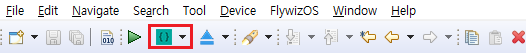

# TF 카드에서 프로그램 시작
ADB를 사용하여 프로그램을 다운로드 할 수 없는 경우 프로그램을 TF 카드에 저장하고 TF 카드에서 프로그램을 시작할 수도 있습니다.
> [!Note]
> **Note : FAT32 형식의 TF 카드만 지원합니다.**

## 제작 과정  
먼저 프로그램의 출력 디렉토리를 구성해야합니다.
1. IDE에서 아래 버튼 찾습니다.
       

2. 검은 색 드롭 다운 화살표를 클릭하고 팝업 메뉴에서 **Path Setup**을 선택합니다.  

   

3. 팝업 상자에서 TF 카드의 드라이브를 선택하고 (TF 카드를 정상적으로 사용할 수 있는지 확인하십시오) 확인을 클릭하십시오.
  
    

4. 위의 단계에서 출력 디렉토리를 구성했습니다. 이제 아래 그림의 버튼을 클릭하여 컴파일을 시작하면 컴파일된 결과를 설정한 드라이브로 패키징하여 저장합니다.

   

5. 작업이 성공하면 **EasyUI.cfg, ui, lib 및 font**와 같은 디렉토리 및 파일이 구성된 드라이브에 생성됩니다.
6. TF 카드를 빼내고 기기에 삽입 한 후 기기의 전원을 다시 켜십시오. 이 때 시스템이 TF 카드의 파일을 감지하면 시스템의 프로그램 대신 카드에서 프로그램을 시작합니다.