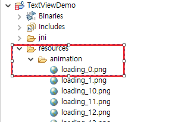

# Text View 컨트롤

## Note

텍스트의 공통 속성을 수정하는 방법을 모르는 경우 [《공통 속성》](ctrl_common # ctrl_common.md)을 참조하세요.

## <span id="add_textview">텍스트 / 라벨을 표시해야 합니다. 어떻게 해야합니까?</span>
텍스트를 표시해야하는 경우 기존 `Text view`로 빠르게 구현할 수 있습니다. 구체적인 단계는 다음과 같습니다.

1. 더블 클릭하여 main.ftu 파일을 엽니다.
2. 오른쪽 컨트롤 박스에서 `Text View`컨트롤을 찾습니다.
3. `Text View` 컨트롤에서 마우스 왼쪽 버튼을 클릭 한 다음 원하는 위치로 드래그하고 왼쪽 버튼을 놓으면 자동으로 생성 된 `Text View` 컨트롤을 볼 수 있습니다.

  


## 코드를 통해 텍스트 컨텐츠를 동적으로 업데이트하는 방법
 시리얼 포트 LCD를 사용할 때 Text View의 컨텐츠는 종종 동적으로 업데이트됩니다. 그런 다음 코드에서 `Text View` 컨트롤에 해당하는 포인터를 통해 Text View 컨트롤의 내용을 동적으로 업데이트 할 수 있습니다. 구체적인 단계는 다음과 같습니다.

1. 먼저 코드에서 텍스트 컨트롤에 해당하는 포인터 변수를 알아야합니다 ([UI 파일의 컨트롤 ID에 해당하는 컨트롤 포인터 변수의 이름 지정 규칙을 모를 경우 여기를 클릭하십시오](named_rule.md)), 여기에 ID가 `Textview1` 인 Text View가 있습니다. 이 컨트롤을 예로 들어 보면 해당 포인터 변수는 `mTextview1Ptr`입니다.
2. Textview1 컨트롤의 텍스트 내용을` "Hello World"`로 수정하려면 텍스트 컨트롤의 멤버 함수`void setText (const char * text)`를 호출하여 수행 할 수 있습니다. 해당`Logic.cc` 파일에서 구체적인 코드는 다음과 같습니다.
```c++
mTextview1Ptr->setText("Hello World");
```
실제 사용 예제 :
 아래 코드의 기능은 다음과 같습니다 : ID가 Button1인 버튼을 누르면 ID가 Textview1인  Text View의 컨텐츠가 "Hello World"로 설정됩니다.

```c++
static bool onButtonClick_Button1(ZKButton *pButton) {
    mTextview1Ptr->setText("Hello World");
    return false;
}
```
3. 문자열 설정 외에도 Text View 컨트롤은 **숫자** 및 **문자** 설정도 지원합니다.

```c++
/* function definition header file: include/control/ZKTextView.h */
void setText(int text);  // set number
void setText(char text); // set character

/* Operation example */
mTextview1Ptr->setText(123); // Textview1 control will display the string "123"
mTextview1Ptr->setText('c'); // The Textview1 control will display the'c' character
```


## <span id = "change_color">텍스트 색상을 수정하는 방법</span>
기본 텍스트는 흰색으로, 다은 두 가지 방법으로 텍스트 색상을 수정할 수 있습니다.

### 속성 창에서 직접 컨트롤의 색상을 수정합니다.

 Project explorer에서 UI 파일을 선택하고 더블 클릭하여 엽니 다.
 미리보기 인터페이스에서 수정할 컨트롤을 찾아 마우스 왼쪽 버튼으로 클릭하면 편집기 오른쪽에서 해당 컨트롤의 속성 창을 볼 수 있습니다. 이때 필요에 따라 속성 값을 입력 할 수 있습니다. Excel과 마찬가지로 수정해야하는 속성을 찾은 다음 수정을 클릭합니다.

 Text View 컨트롤에서는 색상과 관련된 3개의 속성 항목이 있음을 볼 수 있습니다.

 * Foreground Colors
    - 이 속성은 컨트롤의 각 상태에서 텍스트의 색상 값을 개별적으로 설정할 수 있습니다.
 * Background color
     - 컨트롤의 전체 직사각형 영역의 배경색을 설정합니다(컨트롤 상태에 따라 변경되지 않음).
 * Background colors  
    - 배경색 속성의 확장으로 컨트롤의 각 상태에 대한 배경색을 개별적으로 설정할 수 있습니다.

 구체적인 예：  

   

 미리보기：

   

  위 그림은 속성 창의 색상 부분 스크린 샷으로 의미는 배경색이 검은 색, 텍스트 색상이 흰색으로 설정되어 있습니다. 컨트롤이 선택된 상태로 설정되면 텍스트 색상이 빨간색으로 변경됩니다.

### 코드를 통한 색상 변경

 속성 테이블에서 색상을 설정하는 것은 직관적이고 편리하지만 유연성이 부족하여 코드에서 컨트롤 포인터와 해당 멤버 함수를 통해 색상을 동적으로 변경 할 수 있습니다.

  ID `Textview1`의 Text View 컨트롤을 예로 들면 다음과 같은 방법으로 색상을 수정할 수 있습니다.([UI 파일의 컨트롤 ID에 해당하는 컨트롤 포인터 변수의 이름 지정 규칙을 모를 경우 여기를 클릭하십시오](named_rule.md))


 * `void setInvalid(BOOL isInvalid)`  
   
    ```c++
      //Set the control Textview1 to the invalid state; if the `color when invalid` property in the propert table is not empty, 
      //set it to the specified color, otherwise there is no change.
    mTextview1Ptr->setInvalid(true);
    ```
    
 * `void setSelected(BOOL isSelected)`     
   ```c++
      //Set the control Textview1 to the selected state; if the `color when selected` property in the property table is not
      //empty, set it to the specified color, otherwise there is no change.
       mTextview1Ptr->setSelected(true);
   ```
 * `void setPressed(BOOL isPressed)`
   
   ```c++
      //Set the control Textview1 to the pressed state; if the `color when pressed` property in the property sheet is not empty, 
      //set it to the specified color, otherwise there is no change.
       mTextview1Ptr->setPressed(true);
   ```
 * `void setTextColor(int color) //The parameter color represents RGB color in hexadecimal.`
   
   ```c++
      //Set the control Textview1 to red.
      mTextview1Ptr->setTextColor(0xFF0000);
   ```
   
## 소수를 표시하는 방법
Text View 컨트롤은 문자열 설정을위한 인터페이스를 제공합니다.
```c++
	/**
	 * @brief Set string text
	 */
	void setText(const char *text);
```
 숫자를 표시하려면 먼저 'snprintf'함수를 사용하여 숫자를 문자열로 포맷 한 다음 Text View 컨트롤에 설정할 수 있습니다.
 예 :  

```c++
  float n = 3.1415;
  char buf[64] = {0};
  snprintf(buf, sizeof(buf), "%.3f", n); //Fixed display 3 decimal places, extra decimal places will be ignored, if not enough, 
										//0 will be added
  mTextView1Ptr->setText(buf);
```
 `snprintf`는 C 언어 표준 함수로 인터넷에서 관련 정보를 검색하거나 여기 [간단한 소개 및 사용 예](cpp_base.md # snprintf)에서 확인할 수 있습니다.


## 애니메이션 구현
 Text View 컨트롤은 배경 이미지를 추가 할 수 있으므로 단순히 이미지 표시하는 데에도 사용할 수 있습니다.
 한 단계 더 나아가 코드에서 Text View 컨트롤의 배경 이미지를 동적으로 전환하고 전환 시간 간격을 충분히 짧게 한다면 애니메이션 효과를 얻을 수 있습니다.

1. 이미지 자료 준비  
    부드러운 프레임 애니메이션에는 반드시 여러 이미지 리소스가 필요합니다. 여기에서는 총 60 개를 준비했습니다.  
       

     각 이미지는 프레임을 나타내며 일련 번호에 따라 이름이 균일하게 지정되어 주로 연속적으로 사용하기 용이하게 한 것임을 알 수 있습니다.
    
>**Note: 시스템은 이미지를 로드 할 때 더 많은 리소스를 소비하므로 액티비티를 원활하게 실행하려면 사진이 너무 크지 않도록 하는 것이 좋습니다. 예를 들어, 예제에서 하나의 이미지의 크기는 약 5KB 입니다.**

 이 이미지를 프로젝트의 **resources** 디렉토리에 복사합니다. **resources** 디렉토리 아래에 하위 폴더를 만들어 다양한 이미지 리소스를 쉽게 구성하고 분류 할 수 있습니다.
    

    
2. Text View 컨트롤 만들기  
     UI 파일에서 임의의 Text View 컨트롤을 만듭니다. 그리고 Text View 컨트롤의 배경 이미지를 이미지 중 하나로 설정합니다. 여기서는 첫 번째 이미지를 배경 이미지로 설정했습니다. 이 단계는 Text View 컨트롤의 width와 height를 이미지의 width와 height에 맞게 조정하는 것입니다. 설정하지 않도록 선택할 수도 있습니다.
 아래는 전체 속성입니다.


      
3. 프로젝트 컴파일, 타이머 등록  
     Text View 컨트롤을 추가 한 후 프로젝트를 다시 컴파일하고 생성 된 `Logic.cc` 파일에 타이머를 등록하고 시간 간격을 50ms로 설정합니다. 타이머를 사용하여 50ms마다 이미지를 전환합니다.  
    [프로젝트 컴파일 방법](how_to_compile_flythings.md)
    [타이머 등록 방법 ](timer.md)

4. Text View 컨트롤의 배경을 동적으로 전환  
    해당 `Logic.cc` 파일에 다음 함수를 추가하여 배경 이미지를 전환하고 타이머 트리거 함수 `bool onUI_Timer (int id)`에서 호출합니다.

   ```c++
   static void updateAnimation(){
        static int animationIndex = 0;
        char path[50] = {0};
        snprintf(path, sizeof(path), "animation/loading_%d.png", animationIndex);
        mTextviewAnimationPtr->setBackgroundPic(path);
        animationIndex = ++animationIndex % 60;
   }
   ```


   **위의 기능에는 주의해야 할 두 가지 사항이 있습니다.:**

   * **텍스트 컨트롤의 배경 이미지 전환은 `setBackgroundPic (char * path)`함수로 구현됩니다.**
   * **`setBackgroundPic (char * path)`함수의 파라미터는 그림의 상대 경로입니다. 경로는 프로젝트의 `resources` 폴더에 상대적입니다.** 

      **예 : 아래 그림과 같이 프로젝트의 `resources/animation/`폴더에 이미지가 배치되고 이 loading_0.png의 상대 경로는`animation/loading_0.png`입니다.**

       

      `setBackgroundPic (char * path)`함수는 절대 경로를 허용 할 수도 있습니다. 예 : 이미지 `example.png`를 TF의 루트 디렉토리에 넣는 경우 해당 절대 경로는 `/mnt/extsd/example.png`이며 여기서`/mnt/extsd/`는 TF 카드의 경로입니다. 
      다른 경로의 이미지 리소스는 소프트웨어에 자동으로 패키징되지 않으므로 모든 이미지 리소스는 프로젝트의 `resoources`폴더 또는 하위 폴더에 배치하는 것이 좋습니다.

5. [다운로드 및 실행](adb_debug.md)하여 결과를 확인해 봅시다.

6. [샘플 다운로드](# example_download)

## 이미지 문자 세트 사용
 ascii 코드의 정의에 따르면 `character char`와 `integer int` 사이에는 상관 관계가 있습니다. 예를 들어 문자 '0'의 ascii 코드는 '48'입니다. 이미지 문자 집합은 ascii 코드를 이미지에 매핑하는 기능입니다. 이 기능을 설정 한 후 문자열을 표시 할 때 시스템은 문자열의 각 문자를 지정된 이미지에 매핑하고 마지막으로 화면에 이미지 문자열을 표시합니다.

1. 설정 방법   

     

   Text View 컨트롤에서 **Picture Character Set**을 찾아 오른쪽의 **more** 옵션을 클릭하면 이미지 문자 집합 선택 상자가 나타납니다.

     

   오른쪽 상단의 **Import** 버튼을 선택하여 이미지를 문자 집합에 추가합니다. 이미지를 추가 한 후 해당 ascii 코드 또는 문자를 이미지의 매핑 문자로 수정할 수 있습니다. 그런 다음 **Save**를 클릭합니다.
   
2. 이미지 문자 집합이 성공적으로 추가되었는지 확인하기 위해 텍스트를 수정하면 미리보기에서 그 효과를 확인할 수 있습니다.
   **참고 : 이미지 문자 집합을 설정하면 시스템이 각 문자를 문자 집합에 지정된 이미지에 매핑하려고 시도합니다. 문자가 이미지에 설정되지 않은 경우 이 문자는 화면에 표시되지 않습니다. **

### 사용법
1. 위의 이미지 문자 집합 설정 상자에서 우리는 문자 0-9와 : 콜론을 각각 이미지에 매핑했습니다.  
   

    그런 다음 코드에서 `setText (char * str)`함수를 통해 문자열을 설정합니다. TextTime Text View 컨트롤에서 이미지 문자 집합을 설정했으므로 문자는 해당 이미지로 변환됩니다. 

   ```C++
   static void updateTime() {
     char timeStr[20];
     struct tm *t = TimeHelper::getDateTime()
     sprintf(timeStr, "%02d:%02", t->tm_hour, t->tm_min);
     mTextTimePtr->setText(timeStr);
   }
   ```
     

    단일 문자 만 표시해야하는 경우 ascii 코드 또는 문자를 문자열로 변환하지 않고 직접 설정할 수 있습니다.
    예 :

   ```C++
   mTextTimePtr->setText((char)48); //Set the ascii code directly, it needs to be 
									//converted to char
   mTextTimePtr->setText('0'); //Set character directly
   ```

## <span id = "example_download">Sample code</span>

더 자세한 내용은 [Sample code](demo_download.md # demo_download)의 TextViewDemo 프로젝트를 참고하십시오.

미리보기 :


